# Vex Agent

Vex Agent is the agentic core of Vex, a desktop AI assistant for on-chain operations. It runs the turn loop that drives the LLM, manages context pressure through a two-track compaction system, persists durable cross-session knowledge alongside per-session narrative memory, and routes tool calls through both an in-process registry and an embedding-indexed protocol runtime.

The code in this README lives at `src/vex-agent/`. Two surfaces consume it: the local MCP server (`src/mcp/index.ts`) and the Electron desktop app (`vex-app/`). Everything documented here is local-first; agent state, embeddings, and audit trails live in a single PostgreSQL instance with pgvector.

---

## Contents

1. [Architecture overview](#architecture-overview)
2. [Repository layout](#repository-layout)
3. [Public API and consumers](#public-api-and-consumers)
4. [Engine core and prompt stack](#engine-core-and-prompt-stack)
5. [Compaction pipeline (Track 1 + Track 2)](#compaction-pipeline)
6. [Memory policy, redaction, exclusion](#memory-policy-redaction-and-exclusion)
7. [Knowledge store](#knowledge-store)
8. [Tools registry, dispatcher, internal tools](#tools-registry-dispatcher-and-internal-tools)
9. [Protocol runtime](#protocol-runtime)
10. [Database layer](#database-layer)
11. [Embeddings, inference, sync, wake](#embeddings-inference-sync-and-wake)
12. [Maturity markers](#maturity-markers)

---

## Architecture overview

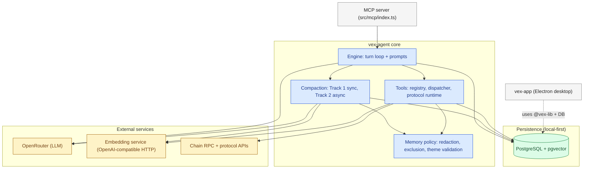

Vex Agent is split into eight cooperating subsystems:

- **Engine core and prompt stack** drives one inference round per turn, composes the layered system prompt, applies stop conditions, and handles approval/wake/recovery transitions.
- **Compaction pipeline** runs a synchronous summary + archive (Track 1) in the same turn the agent commits to compaction, and dispatches an asynchronous chunker (Track 2) that produces structured narrative chunks for later recall.
- **Memory policy, redaction, exclusion** owns hard-coded constants (chunk size, pressure bands, recall thresholds), the two-tier redactor, exclusion rules that block live-state from persistence, and theme slug validation.
- **Knowledge store** is the durable cross-session memory: agent-defined kinds, multi-signal ranking (similarity + recency + confidence + pinned), TTL with pinned-as-evergreen, and explicit lineage via supersede.
- **Tools registry, dispatcher, internal tools** is the catalog of in-process actions the agent can take: knowledge writes, document scratchpad, wallet reads, mission control, compaction primitives. Visibility is gated by session mode, role, permission, and context pressure band.
- **Protocol runtime** wraps external-tool dispatch in two meta-tools (`discover_tools`, `execute_tool`), discovers candidates by dense embedding search with lexical fallback, and validates capture contracts before any state lands in the projection pipeline.
- **Database layer** owns Postgres connectivity, the migration runner with advisory-lock serialization, the transaction-aware executor pattern, and 18 numbered migrations that capture every schema decision.
- **Embeddings, inference, sync, wake** provide the supporting infrastructure: OpenAI-compatible HTTP embedding client with pinned formatter, OpenRouter for the LLM, a 60-second portfolio sync executor, and a database-claimed wake scheduler for `loop_defer`.

---

## Repository layout

```
src/vex-agent/
├── engine/                 turn loop, prompts, compaction, wake, ingress, runtime clock
│   ├── core/               runner (agent/mission), turn-loop, turn, context-band, stop-conditions, hydrate, resume, reject, transcript-integrity
│   ├── prompts/            17 prompt fragments (base, mode, mission-run, mission-setup, memory-state, knowledge-state, context-pressure, resume-packet, tool-catalog, tool-usage, sanitize, ...)
│   ├── compact-jobs/       Track 2 outbox worker (executor.ts) + Track 1 service (service.ts)
│   ├── wake/               loop_defer scheduler (executor.ts)
│   ├── subagents/          subagent runner (defined; runtime currently dormant)
│   ├── ingress.ts          routing of user messages, operator interrupts
│   ├── runtime-clock.ts    deadline/elapsed/start-time prompt fragment
│   ├── index.ts            public API surface
│   └── types.ts            baseline engine types (SessionKind, Permission, MissionRunStatus, ...)
├── memory/                 policy constants, two-tier redaction, exclusion rules, theme validation
├── knowledge/              policy (TTL, kind regex), ranking, content-hash, recall-payload
├── tools/                  registry (catalog by domain), dispatcher (gates + approvals), internal handlers
│   ├── registry/           one file per domain (vex, web, wallet, portfolio, evm, knowledge, memory, documents, compact, autonomy, protocol)
│   ├── internal/           ~30 handler modules (lazy-loaded)
│   ├── protocols/          discover_tools, execute_tool, manifest catalog, mutation matrix, capture validator, telemetry
│   ├── dispatcher.ts       single entry point for tool execution
│   ├── registry.ts         visibility context, pressure-safety filter, catalog projection
│   └── types.ts            ToolDef, ToolVisibilityContext, ToolResult
├── db/                     Postgres client, migration runner, repos, migrations
│   ├── client.ts           Pool config + Executor pattern (queryWith / query)
│   ├── migrate.ts          delegates to shared migration runner with advisory lock
│   ├── migrations/         18 forward-only SQL migrations (001 through 018)
│   └── repos/              35+ repositories (sessions, messages, mission-runs, knowledge, session-memories, compact-jobs, approvals, balances, lp-events, ...)
├── embeddings/             OpenAI-compatible HTTP client, formatter version, env-driven config
├── inference/              provider registry, OpenRouter client, resilience, schema normalizer, config
├── sync/                   portfolio sync executor (60s tick), balance/LP/MTM jobs, projectors
├── scripts/                CLI utilities (knowledge import/export/reembed, tool reembed, tool embeddings health, cross-lingual benchmark)
└── e2e/                    integration tests, live scenarios, MCP testing harness
```

There is no root `index.ts` in `vex-agent/`. Callers import from named subfolders, primarily `@vex-agent/engine`, `@vex-agent/sync`, `@vex-agent/db`, and `@vex-agent/tools/registry`.

---

## Public API and consumers

The MCP server (`src/mcp/index.ts`) is the primary consumer. It calls into `vex-agent/engine/index.ts` for the turn loop, into `vex-agent/sync` for the portfolio executor, into `vex-agent/db` for migrations and repos, and into `vex-agent/tools/registry` for tool definitions exposed over MCP.

The Electron desktop app at `vex-app/` does not directly import from `vex-agent/`. It reaches the same database (local Postgres) and uses the shared library at `src/lib/` through a Vite alias (`@vex-lib`); see `.claude/rules/80-edge-cases.md` section 4 for the monorepo install constraints.

The exported public functions from `engine/index.ts`:

| Function | Signature | File:Line | Purpose |
|----------|-----------|-----------|---------|
| `processAgentTurn` | `(sessionId, userInput) → Promise<TurnResult>` | engine/core/runner/agent.ts:29 | One-shot conversational turn; chat semantics, stops on final text. |
| `processMissionSetupTurn` | `(missionId, userInput) → Promise<TurnResult>` | engine/core/runner/setup-turn.ts | Mission draft phase; read-only tools, no mutations. |
| `startMission` | `(missionId) → Promise<TurnResult>` | engine/core/runner/mission.ts:83 | Validate, freeze contract, inject activation, enter turn loop until stop. |
| `resumeMissionRun` | `(missionRunId) → Promise<TurnResult>` | engine/core/runner/mission.ts | Resume from paused_approval / paused_wake / paused_error. |
| `recoverFailedMissionRun` | `(missionRunId) → Promise<TurnResult>` | engine/core/runner/recover.ts | Recovery path for runs stuck in paused_error. |
| `approveAndResume` | `(approvalId) → Promise<TurnResult>` | engine/core/resume.ts:28 | Atomically approve a pending tool call, dispatch with approved=true. |
| `rejectApproval` | `(approvalId) → Promise<ApprovalItem | null>` | engine/core/reject.ts:20 | Reject one pending call without aborting the mission. |
| `runTool` | `(toolName, args, toolContext) → Promise<DispatchResult>` | engine/core/run-tool.ts | Direct tool dispatcher used by the turn loop. |
| `runSubagentEngine` | `(sessionId, mission, context) → Promise<SubagentResult>` | engine/subagents/runner.ts | Subagent execution entry (delegated task). |
| `routeUserMessage` | `(userId, input, ...) → Promise<RoutingResult>` | engine/ingress.ts | Ingress router; classifies input and routes to agent/mission flow. |
| `submitOperatorInstruction` | `(sessionId, instruction) → Promise<void>` | engine/ingress.ts | Enqueue an operator interrupt (pause, abort, rewind). |
| `startWakeExecutor` | `() → Disposable` | engine/wake/executor.ts | Boot the loop_defer scheduler (single-instance). |
| `startCompactJobsExecutor` | `() → Disposable` | engine/compact-jobs/executor.ts | Boot the Track 2 chunker worker (single-instance). |

---

## Engine core and prompt stack

### Purpose

The engine core executes every agent turn and mission cycle. It hydrates session state, builds the layered prompt, calls the inference provider, dispatches tools, persists state changes, and enforces runtime guardrails (iteration limits, timeout, context pressure bands, approval requirements). It returns deterministic turn results or pauses on approval, wake, or error. All session and run-state writes go through this module.

### Turn loop lifecycle

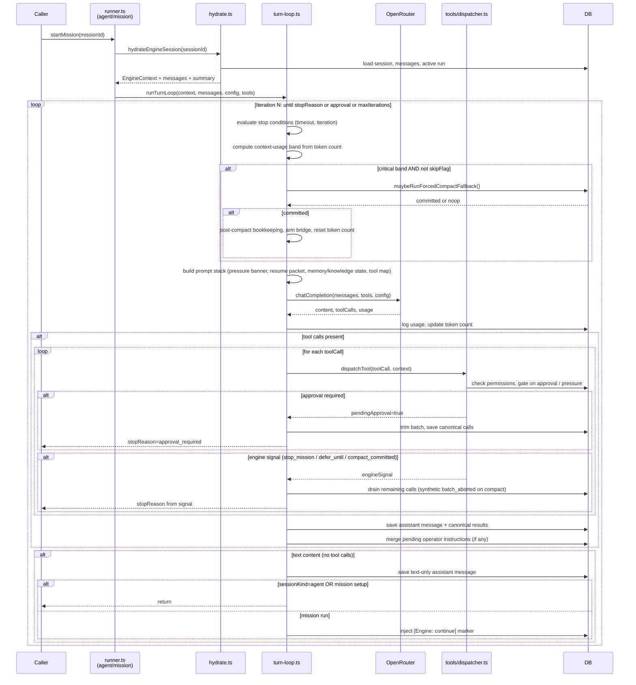

### Prompt stack composition

The system prompt is built as an ordered sequence of layers joined by `"\n\n---\n\n"`. Layer order is fixed; presence of each layer depends on session mode and active state.

1. **Base prompt** (`engine/prompts/base.ts:11`) Vex identity, aspect (`agent | mission-setup | mission-run | subagent`), mode/permission context, IDs, loaded documents.
2. **Runtime clock** (`engine/runtime-clock.ts`) session start, run start, deadline, elapsed.
3. **Context pressure banner** (`engine/prompts/context-pressure.ts:10`) empty at normal, informational at warning, directive at barrier, exclusive directive at critical.
4. **Resume packet** (`engine/prompts/resume-packet.ts:38`) present for `POST_COMPACT_BRIDGE_CYCLES` (default 2) turns after compaction. Contains rolling summary, sanitized `preserve_md`, unresolved outstanding items, recent decisions and tool outcomes.
5. **Memory state banner** (`engine/prompts/memory-state.ts:11`) active narrative chunks, compacts done, recent themes, unresolved outstanding count.
6. **Knowledge state banner** (`engine/prompts/knowledge-state.ts:16`) long-term entry count, top kinds.
7. **Active knowledge block** (`engine/prompts/knowledge.ts`) curated hot-context entries plus known-kinds line.
8. **Memory routing rule** (`engine/prompts/memory-routing.ts:18`) four-line decision hierarchy: current state to live tools, prior in-session to `memory_recall`, cross-session to `knowledge_recall`, scratchpad to `document_read`.
9. **Tool catalog prompt** (`engine/prompts/tool-catalog.ts:29`) built from the same `ToolVisibilityContext` that filters the tool array sent to the provider.
10. **Tool usage prompt** (`engine/prompts/tool-usage.ts:15`) selection rules, live-state guidance, protocol flow, safety rules.
11. **Protocols prompt** (`engine/prompts/protocols.ts:65`) auto-generated from protocol manifests; namespace navigation, tool counts, env requirements.
12. **Permission prompt** (`engine/prompts/mode.ts:20`) one of `AGENT_RESTRICTED | AGENT_FULL | MISSION_RESTRICTED | MISSION_FULL`.
13. **Mode-specific prompt** agent (`agent.ts:7`), mission setup (`mission-setup.ts:16`), mission run (`mission-run.ts:17`), or subagent (`subagent.ts`).

### Context pressure bands

| Band | Trigger | Enforcement | File:Line |
|------|---------|-------------|-----------|
| normal | < 66% | all tools visible, no banner | `context-band.ts:40-47` |
| warning | 66 to 88% | all tools visible, info banner | `context-pressure.ts:19` |
| barrier | 88 to 95% | mutations hidden in catalog and hard-denied at dispatch; only `read_only`, `safe_at_barrier`, and `compact_only` visible | `context-pressure.ts:21-26` |
| critical | >= 95% | same as barrier; turn loop may run forced compact at iteration top if agent did not call `compact_now` | `context-pressure.ts:28-32`, `turn-loop.ts:282-323` |

Thresholds live in `memory/policy.ts` as `PRESSURE_WARNING_FRACTION`, `PRESSURE_BARRIER_FRACTION`, `PRESSURE_CRITICAL_FRACTION`. The same context drives both tool projection and the in-prompt tool map, so the LLM's mental map of available actions cannot drift from what the dispatcher accepts.

### Stop conditions

- `approval_required` (`turn-loop.ts:436`) a tool call needs operator approval; run enters `paused_approval`.
- `waiting_for_wake` (`turn-loop.ts:462-476`) `loop_defer` requested a future resume; row persists in `loop_wake_requests`.
- `waiting_for_parent` (`turn-loop.ts:457-460`) subagent escalated to parent via `subagent_request_parent`.
- `iteration_limit` (`turn-loop.ts:248-253`) reached `maxIterations`; mission runs convert to `loop_defer`, agent turns return.
- `timeout` (`turn-loop.ts:248-253`) elapsed time reached `timeoutMs`; mission runs convert to `loop_defer`.
- `compact_unable_at_critical` (`turn-loop.ts:307-321`) forced fallback returned `noop` `COMPACT_MAX_CONSECUTIVE_NOOPS` times; run enters `paused_error`.
- `system_error` uncaught error; run enters `paused_error`.
- Mission contract stops (`types.ts:112-117`) `goal_reached`, `deadline_reached`, `capital_depleted`, `max_loss_hit`, `no_viable_opportunity`, `emergency_stop`.
- `user_stopped` (`turn-loop.ts:243, 382`) AbortSignal fired.

### Key design decisions

1. **Deferred message save with canonical-batch trimming** (`turn-loop.ts:31-38`). Assistant messages and tool results are not saved immediately after `executeTurn`. The loop computes a canonical prefix (only dispatched tool calls, dropping any trailing calls cut by approval or engine signal) and saves once. The alternative (eager save plus orphan cleanup) was rejected because tracking insertion order in an auto-increment id schema is fragile.
2. **Post-compact bridge counter and resume packet** (`turn-loop.ts:148-152, 335-355`). After any compaction commit, the bridge is armed once from `sessions.checkpoint_generation` and decremented each turn. The resume packet contains compact output plus outstanding items, so a post-compact turn has explicit context for what persisted, instead of relying on the message-only tape.
3. **Critical-band noop counter and forced fallback** (`turn-loop.ts:282-323`). At critical, the runtime attempts a forced fallback compaction. If it returns `noop` twice in a row, the loop stops with `compact_unable_at_critical` instead of spinning. The counter resets when the band drops below critical or a compaction commits.
4. **Transcript integrity repair in flight** (`transcript-integrity.ts:48-100`). Before each provider call, the loop walks the message array and synthesizes placeholder tool results for any orphaned `tool_calls`. Repair is in-memory only; the DB tape stays exact, and the synthesis cost is paid once per turn.
5. **Single visibility context for tools and prompt map** (`turn-loop.ts:363-372`). `ToolVisibilityContext` is computed once per iteration and feeds both `getOpenAITools` (provider array) and `buildToolCatalogPrompt` (Tool Map in the system prompt). The two views cannot drift, eliminating a known failure mode of agents calling tools the dispatcher rejects.

### Gotchas

1. `currentTokenCount` represents the previous turn's prompt size, set after the provider response. Pressure-band decisions therefore lag by one turn. Post-compact the count is reset to 0, so the first post-compact iteration always reads as `normal` regardless of the actual prompt size of the resume packet (`context-band.ts:14-20`).
2. `BATCH_ABORTED_BY_COMPACT_OUTPUT` is synthesized for tool calls that were emitted but skipped after a mid-batch compact commit (`turn-loop.ts:484-495`). The assistant message keeps the full original `tool_calls` JSONB; only some are dispatched. If you inspect rows directly, the apparent mismatch is by design and the synthetic results preserve the provider's call/result pairing invariant.
3. Operator instructions are merged after dispatch (`turn-loop.ts:199-228`) so an interrupt that fires while a tool batch is in flight lands chronologically after the batch results.
4. `sessions.token_count` is set, not incremented (`turn.ts:141-152`). It tracks the latest prompt size for pressure evaluation only. Cumulative spend lives in `usage_log`.
5. `EngineContext.loadedDocuments` is ephemeral (in-memory map). On approval pause or session rehydration it is dropped; the agent must re-read via `document_read`.

---

## Compaction pipeline

### Purpose

Compaction reduces session memory footprint and produces durable narrative chunks. Track 1 (synchronous) redacts, archives, and bumps the session checkpoint generation inside the compact transaction. Track 2 (asynchronous) consumes that generation via a `compact_jobs` outbox, calls a chunker LLM, validates and redacts the output, computes embeddings, and persists rows to `session_memories`. The split keeps compact latency unaffected by provider or embedding-service availability: the agent's summary and archive land synchronously, while chunking happens in a retrying background worker.

### Track 1 vs Track 2

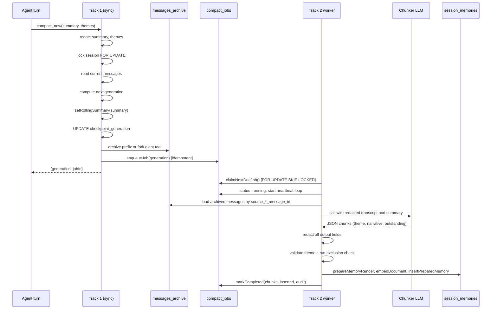

### Compact job lifecycle

```mermaid
stateDiagram-v2
    [*] --> pending: enqueueJob()
    pending --> running: claimNextDueJob() sets status='running', locked_by=workerId, heartbeat_at=NOW()
    running --> completed: markCompleted()
    running --> failed: markFailed() when attempt_count < max_attempts; schedules next_attempt_at with backoff
    failed --> pending: next poll cycle once next_attempt_at <= NOW()
    failed --> permanently_failed: markFailed() when attempt_count >= max_attempts
    pending --> permanently_failed: bootstrap detects stale running (heartbeat_at older than 2 min)
    completed --> [*]
    permanently_failed --> [*]
```

### session_memories schema

| Column | Type | Role | Constraint / Index |
|--------|------|------|--------------------|
| `id` | SERIAL PK | row id | auto |
| `session_id` | TEXT NOT NULL | FK `sessions(id) ON DELETE CASCADE` | |
| `checkpoint_generation` | INTEGER NOT NULL | generation that produced this chunk | `idx_sm_generation` |
| `theme` | TEXT NOT NULL | slug, 3 to 8 underscore-separated tokens (e.g. `kyber_quote_timeout`) | shape regex |
| `theme_source` | TEXT NOT NULL | `handoff` / `chunker` / `fallback` | CHECK |
| `entities` `protocols` `error_classes` `chains` `tasks` | TEXT[] | structured discriminators | GIN on `entities` |
| `happened_md` `did_md` `tried_md` | TEXT | three narrative sections | |
| `body_md` | TEXT NOT NULL | materialized markdown rendering | |
| `body_md_schema_version` | TEXT NOT NULL DEFAULT `'v1'` | template version | |
| `body_md_hash` | CHAR(64) NOT NULL | SHA256(`body_md`); rotates on `markOutstandingResolved` to guard stale embedding writes | |
| `outstanding_items` | JSONB NOT NULL DEFAULT `'[]'` | array of `{id, text, created_at, resolved_at, resolution_note, resolution_source}` | |
| `source_start_message_id` `source_end_message_id` | INTEGER | archived range | |
| `inference_model` | TEXT | chunker model name | |
| `importance` | INTEGER NOT NULL DEFAULT 5 | quality signal [1,10] | |
| `confidence` | NUMERIC(3,2) NOT NULL DEFAULT 0.5 | chunker self-confidence | |
| `status` | TEXT NOT NULL DEFAULT `'active'` | `active` / `superseded` / `merged_into` | `idx_sm_session_active` |
| `superseded_by_id` | INTEGER FK SELF | replacement link | |
| `embedding` | vector (no typmod) | dense vector; row-level `embedding_dim` is authoritative | |
| `embedding_model` `embedding_dim` | TEXT, INTEGER | mandatory audit columns; recall must filter both | `idx_sm_embedding_match` |
| `content_hash` | CHAR(64) NOT NULL | SHA256(theme + happened_md + did_md + tried_md), length-prefixed; outstanding items and body_md are intentionally excluded | partial unique `(session_id, content_hash) WHERE status='active'` |
| `created_at` `updated_at` | TIMESTAMPTZ | audit | |

`content_hash` is the chunk's identity. Two chunks with identical narrative core but different outstanding lists collide on dedup; the second insert is a no-op. This is by design: the narrative is immutable, outstanding items are mutable annotations.

`body_md_hash` is computed after outstanding items are rendered into `body_md`. When `markOutstandingResolved` flips a single item's `resolved_at`, the body re-renders, `body_md_hash` updates, and any concurrent `updateEmbedding` call with a stale expected hash is rejected by the WHERE clause. This closed the PR3-final race window.

### compact_jobs schema

| Column | Type | Role |
|--------|------|------|
| `id` | SERIAL PK | job id |
| `session_id` | TEXT NOT NULL | FK `sessions` |
| `checkpoint_generation` | INTEGER NOT NULL | scopes work to one generation; uniq `(session_id, checkpoint_generation)` prevents double-enqueue |
| `status` | TEXT NOT NULL DEFAULT `'pending'` | `pending` / `running` / `completed` / `failed` / `permanently_failed` |
| `agent_summary` | TEXT NOT NULL | Track 1 summary, redacted, fed to chunker |
| `preserve_md` | TEXT | redacted preserve hints (unresolved items) |
| `thread_themes_hints` | TEXT[] | redacted theme suggestions |
| `source_start_message_id` `source_end_message_id` | INTEGER | archived range Track 2 loads |
| `attempt_count` `max_attempts` | INTEGER | retry budget |
| `next_attempt_at` | TIMESTAMPTZ | due time, set by `markFailed` with exponential backoff |
| `locked_at` `locked_by` `heartbeat_at` | TIMESTAMPTZ, TEXT, TIMESTAMPTZ | claim ownership; owner is checked on every transition |
| `last_error` | TEXT | most recent failure reason |
| `chunks_inserted` `chunks_rejected_by_exclusion` `chunks_rejected_by_redaction` | INTEGER | per-job audit |
| `inference_provider` `inference_model` `inference_completed_at` `cost_usd` | TEXT, TEXT, TIMESTAMPTZ, NUMERIC | provider audit; no secrets in row |
| `created_at` `started_at` `completed_at` | TIMESTAMPTZ | lifecycle timestamps |

### Executor loop (`engine/compact-jobs/executor.ts`)

1. **Stale recovery on bootstrap** (`executor.ts:86-97`). Reset any `running` rows whose `heartbeat_at` is older than `WORKER_STALE_THRESHOLD_MS` (2 min) back to `pending` with backoff applied. Failures are logged and non-fatal.
2. **Provider gate** (`executor.ts:106-113`). If `OPENROUTER_API_KEY` or `AGENT_MODEL` is missing, skip the tick without claiming. This prevents burning retry budget on misconfiguration.
3. **Claim** (`executor.ts:114`). `claimNextDueJob(workerId)` runs `FOR UPDATE SKIP LOCKED`, sets status to `running`, increments `attempt_count`, and returns the row.
4. **Session mutex** (`executor.ts:116-120`). In-process `Set<sessionId>` prevents two concurrent claims processing the same session in one worker.
5. **Load archive prefix** (`executor.ts:193-214`). Empty range is treated as an error so the job retries rather than completing with zero chunks.
6. **Heartbeat loop** (`executor.ts:166-190`). `setInterval` calls `heartbeat(jobId, workerId)` every `WORKER_HEARTBEAT_INTERVAL_MS`. Owner mismatch flips `claimLost`, which short-circuits remaining expensive stages.
7. **Chunker call** with `TRACK2_TIMEOUT_MS` (30s). Output is Zod-validated.
8. **Redact** all fields (`executor.ts:223-294`); count hard and mask redactions.
9. **Theme validate or fallback** (`executor.ts:249-264`). Stamp `theme_source` accordingly.
10. **Exclusion check** (`executor.ts:275-284`). Skip the chunk if `liveFraction >= EXCLUSION_REJECT_THRESHOLD`.
11. **Exact-body embedding contract** (`executor.ts:296-337`). `prepareMemoryRender` produces UUIDs, `body_md`, and `content_hash`. `embedDocument` consumes that exact body. `insertPreparedMemory` persists the same bytes. The triple keeps embedded text and stored text identical.
12. **Mark completed / failed** (`executor.ts:352-390`). Owner-checked; missing claim aborts the transition. `markFailed` schedules `next_attempt_at = NOW() + backoff` or transitions to `permanently_failed`.

### Recall

`session-memories/recall.ts` runs a single SQL query: cosine distance (`<=>`) ordered limit, filtering on `session_id`, `status='active'`, `embedding_model`, and `embedding_dim`. Returns top-K above `MEMORY_RECALL_MIN_SIMILARITY` (0.30). Cross-session recall is not supported by design (per-session narrative degrades when mixed).

### Key design decisions

1. **Two-track decoupling.** Track 1 must land synchronously: the summary and archive are durable before turn completion. Track 2 is backgrounded so provider outage does not block the agent. If Track 2 fails, retries run on the outbox; compaction itself succeeds (`executor.ts:6`, `service.ts:27-29`).
2. **Content hash excludes outstanding items.** Outstanding items mutate via `markOutstandingResolved`. If they were part of the hash, every resolution would break the partial unique invariant. The narrative is the chunk's identity, outstanding items are annotations on it (migration 016 lines 10-29).
3. **Exact-body embedding triple.** `prepareMemoryRender` -> `embedDocument` -> `insertPreparedMemory` must run in order on the same body bytes. Without this, the embedded text can diverge from the stored text. Codex P1 flagged this as a correctness blocker (`executor.ts:304-337`).
4. **Owner-checked transitions.** `heartbeat`, `markCompleted`, `markFailed` all check `locked_by = workerId`. A worker whose job was reclaimed by stale recovery cannot complete or fail the row (`crud.ts:157-191, 203-249`).
5. **Pre-claim provider gate.** Missing `OPENROUTER_API_KEY` or `AGENT_MODEL` skips the tick instead of claiming and failing, preserving retry budget for actual chunker errors (`executor.ts:106-113`).

### Gotchas

1. **body_md_hash race window** (fixed in PR3-final, commit d917d23). Concurrent `markOutstandingResolved` calls could overwrite each other's fresh embeddings. The fix computes the hash atomically and gates `updateEmbedding` on it (`crud.ts:435 WHERE body_md_hash = $expectedHash`).
2. **Generation invariant per session.** `withCheckpointMutex(sessionId, ...)` serializes concurrent compactions on one session. Two compactions on the same generation cannot both enqueue thanks to `uniq_compact_jobs_generation` (migration 017 lines 65-67).
3. **Stale recovery is non-fatal.** If bootstrap recovery fails, the next poll picks up the stale row again. The worker still starts.
4. **Dedup ignores outstanding-item drift.** If the same chunk is re-emitted with a different outstanding list, the existing row's items are preserved. Outstanding-item updates flow through `markOutstandingResolved`, not through chunker re-emission.
5. **Attempt count increments on claim, not on completion.** A job that fails immediately retries only if `attempt_count < max_attempts` at the next due time. Stale recovery resets to pending without consuming a budget slot.

---

## Memory policy, redaction, and exclusion

### Purpose

`memory/` is the policy layer for narrative memory. It holds the constants every downstream component reads (chunk sizes, recall thresholds, pressure bands, retry budgets), the two-tier redactor used before any chunk persistence, the exclusion rules that block live-state from embedding storage, and the theme-slug validator.

### Policy constants

| Constant | Value | Scope | File:Line |
|----------|-------|-------|-----------|
| `MAX_THEME_HINTS` | 3 | hints passed to chunker | `policy.ts` |
| `CHUNK_SECTION_MAX_CHARS` | 2000 | per narrative section | `policy.ts` |
| `CHUNK_BODY_MAX_CHARS` | 8000 | total materialized body | `policy.ts` |
| `MAX_OUTSTANDING_ITEMS_PER_CHUNK` | 5 | items per chunk | `policy.ts` |
| `OUTSTANDING_ITEM_TEXT_MAX` | 500 | chars per item | `policy.ts` |
| `MEMORY_RECALL_DEFAULT_K` `MEMORY_RECALL_MAX_K` | 5, 5 | recall top-K | `policy.ts` |
| `MEMORY_RECALL_MIN_SIMILARITY` | 0.30 | cosine threshold | `policy.ts` |
| `MEMORY_BANNER_RECENT_THEMES_LIMIT` | 5 | banner cap | `policy.ts` |
| `KNOWLEDGE_BANNER_TOP_KINDS_LIMIT` | 5 | banner cap | `policy.ts` |
| `PRESSURE_WARNING_FRACTION` | 0.85 | banner gate | `policy.ts` |
| `PRESSURE_BARRIER_FRACTION` | 0.88 | tool visibility, dispatcher gate | `policy.ts` |
| `PRESSURE_CRITICAL_FRACTION` | 0.92 | forced fallback trigger | `policy.ts` |
| `POST_COMPACT_BRIDGE_CYCLES` | 2 | resume packet turns | `policy.ts` |
| `WORKER_HEARTBEAT_INTERVAL_MS` | 20000 | worker heartbeat | `policy.ts` |
| `WORKER_STALE_THRESHOLD_MS` | 120000 | stale row detection | `policy.ts` |
| `WORKER_MAX_ATTEMPTS` | 3 | retry budget | `policy.ts` |
| `TRACK2_TIMEOUT_MS` | 30000 | chunker call timeout | `policy.ts` |
| `TRACK2_RETRY_BACKOFF_BASE_MS` | 30000 | base for exponential backoff | `policy.ts` |
| `EXCLUSION_REJECT_THRESHOLD` | 0.30 | live-state fraction for chunk rejection | `policy.ts:108` |

Knowledge sources: `KNOWLEDGE_SOURCES = ["observed", "user_confirmed", "inferred", "hypothesis"]`, with `HOT_CONTEXT_SOURCES = ["observed", "user_confirmed"]` as the subset that flows into the always-on system prompt (`policy.ts:134-155`).

Theme validation: `THEME_REGEX = /^[a-z][a-z0-9]*(?:_[a-z0-9]+){2,7}$/` plus a stoplist of standalone degenerate tokens (`mission`, `session`, `debug`, `setup`, `work`, `task`, `general`, `various`, `miscellaneous`, `context`, `conversation`, `chat`, ...) (`policy.ts:83-99`).

### Two-tier redaction

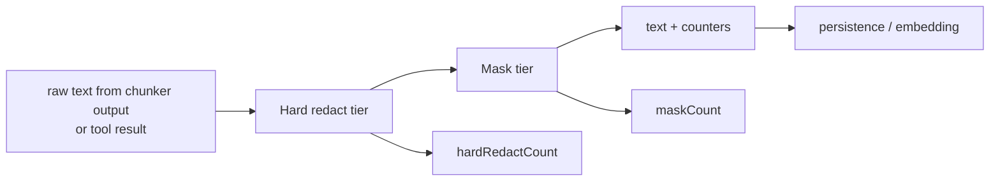

**Hard redact tier** replaces sensitive material with `[REDACTED:<class>]` tokens. Patterns are applied in order:

| Class | Pattern intent | Replacement | File:Line |
|-------|----------------|-------------|-----------|
| labelled private key (0x) | `private_key` / `seed_key` / `wallet_key` / `secret_key` followed by 40 to 128 hex | `[REDACTED:private_key]` | `redaction.ts:54` |
| raw hex key (labelled) | key label + 64-hex without 0x | `[REDACTED:private_key]` | `redaction.ts:57` |
| API key (known prefixes) | `sk-`, `sk_live_`, `sk_test_`, `pk_live_`, `pk_test_`, `sk-or-`, `sk-ant-` | `[REDACTED:api_key]` | `redaction.ts:60` |
| JWT | `eyJ...\....\....` | `[REDACTED:jwt]` | `redaction.ts:63` |
| BIP39 mnemonic | 12 to 24 lowercase words 3 to 8 chars, space-separated, no punctuation in match | `[REDACTED:mnemonic]` | `redaction.ts:69` |

**Mask tier** preserves semantic shape so the LLM still recognizes the identifier type. Order: tx hashes, then EVM addresses, then Solana addresses.

| Class | Example in | Example out | File:Line |
|-------|------------|-------------|-----------|
| transaction hash | `0xabcdef0123...6789` | `0xabcd...6789` | `redaction.ts:79` |
| EVM address | `0x742d35Cc...f44e` | `0x742d...f44e` | `redaction.ts:74` |
| Solana address | `EPjFWdd5...Dt1v` | `EPjF...Dt1v` | `redaction.ts:84` |

The `RedactionResult` returns `{ text, hardRedactCount, maskCount }`. The executor sums counts across chunk fields and emits `compact-worker.chunk_redacted` for any chunk with `hardRedactCount > 0`. The chunk is not rejected on redaction count alone; redaction is a hardening step, not a kill switch.

### Exclusion rules

`exclusion-rules.ts` rejects chunks whose content is dominated by live state: balances, prices, gas, block heights, intent IDs. These values are tracked in tool output and `proj_*` tables and would render the chunk stale within minutes.

Pattern catalog (`exclusion-rules.ts:43-84`):

| Category | Example match |
|----------|----------------|
| `balance_amount` | `1.2 SOL`, `5,000 USDC` |
| `fiat_price` | `$0.0042`, `€500` |
| `gas_amount` | `5 gwei`, `100 wei` |
| `slippage_pct` | `0.15% impact`, `5% slippage` |
| `chain_height` | `block 18293821`, `slot 195832184` |
| `pending_tx` | `tx 0xabcd...1234` |
| `literal_state` | `balance is 5 USDC`, `current price = $1.05` |
| `now_timestamp` | `as of 14:32Z` |

`scanLiveState` counts words inside each match (`exclusion-rules.ts:121-124`), sums them, and computes `liveFraction = matchedWords / totalWords`. If `liveFraction >= 0.30`, the chunk is rejected; counts by category are returned for telemetry.

### Theme validation

`theme-validation.ts` (lines 35-66) enforces:

1. Type is string and trimmed length > 0.
2. 3 to 8 underscore-separated tokens.
3. Shape regex.
4. Stoplist: if every non-trivial token (length >= 3) is in `THEME_STOPLIST_STANDALONE`, reject with reason `standalone_stopword`.

Rejection reasons: `empty`, `not_string`, `too_short`, `shape_invalid`, `standalone_stopword`.

Fallback theme generation (`theme-validation.ts:78-110`) composes a slug from structured fields when the chunker emits a degenerate theme: `<entity>_<task>_observation`, `<entity>_<chain>_observation`, `<entity>_observation_chunk`, or `unclassified_observation_gen_<generation>` as the last resort. Chunk metadata records `theme_source = 'fallback'`.

### Key design decisions

1. **Two tiers, not one.** Hard redaction is for secrets that constitute a security incident if leaked; mask redaction preserves enough shape so the LLM still understands an identifier's role. A single tier would either over-redact (LLM can no longer reason about addresses) or under-protect (raw keys persisted).
2. **Centralized constants.** Every limit and threshold lives in `memory/policy.ts`. A per-caller config model risked drift (one component using k=3, another k=5). Single source of truth keeps the chunker prompt, executor, dispatcher, and pressure observer aligned.
3. **English-only narrative.** After the cross-lingual pivot (Phase 0), chunker output is normalized to English before embedding. This keeps one embedding-language convention across knowledge and session memory.
4. **Chunk-level exclusion.** A 30%-live-state chunk is rejected wholesale, not stripped. Surgical edits risked inverting meaning; the chunker is free to re-emit a focused version.
5. **Word-count density metric.** `scanLiveState` measures fraction of total words inside matched live-state patterns, not raw match count. A chunk with one large multi-word match counts differently from one with several single-word matches.

### Gotchas

1. The Solana mask regex can over-match on long base58-shaped substrings in prose. Risk is bounded because masking is non-destructive and the exclusion stage rejects mostly-live chunks anyway.
2. The BIP39 heuristic admits false positives on 12+ word English sentences without punctuation. The `if (/[.,;!?]/.test(match))` guard at `redaction.ts:121` suppresses most of these. Hard redaction here is conservative on purpose.
3. Pressure bands lag one turn (token count from previous turn). The forced-fallback compact is the safety net.
4. The theme stoplist is English-only. Non-English themes would slip past the stoplist but fail shape validation (`toSlugToken` normalization).
5. No hard-redact reject threshold. A chunk with several hard redactions still persists; telemetry lets a human decide whether to tighten policy.

---

## Knowledge store

### Purpose

Knowledge is durable cross-session memory. Entries persist indefinitely, are indexed by vector embedding, and are recalled by semantic similarity reranked with recency, agent-reported confidence, and pinned status. The agent writes via `knowledge_write`; only verified sources (`observed`, `user_confirmed`) flow into the always-on system prompt block. Inferred facts and hypotheses are still queryable via `knowledge_recall` but do not pollute continuous injection.

### knowledge_entries schema

| Column | Type | Role |
|--------|------|------|
| `id` | SERIAL PK | row id |
| `kind` | TEXT NOT NULL | agent-defined taxonomy; regex `/^[a-z][a-z0-9_]*$/` enforced (`knowledge/policy.ts:101`) |
| `title` | TEXT NOT NULL | one-line summary, fed to embedding input |
| `summary` | TEXT NOT NULL | 1 to 3 sentences, fed to embedding input |
| `content_md` | TEXT DEFAULT `''` | full markdown body, returned in recall |
| `tags` | TEXT[] | free-form labels; GIN `idx_ke_tags` |
| `source_refs` | JSONB | audit back-links (`{protocol_executions: [...], proj_pnl_lots: [...]}`); GIN `idx_ke_source_refs` |
| `confidence` | REAL | agent-reported 0..1, optional |
| `status` | TEXT DEFAULT `'active'` | `active` / `superseded` / `invalidated` / `archived`; `idx_ke_status_validity` |
| `pinned` | BOOLEAN DEFAULT FALSE | partial idx `idx_ke_pinned WHERE pinned=TRUE` |
| `valid_from` | TIMESTAMPTZ DEFAULT NOW() | start validity (audit only) |
| `valid_until` | TIMESTAMPTZ | expiry; NULL when pinned |
| `content_hash` | CHAR(64) UNIQUE | SHA256 length-prefixed `kind|title|summary|content_md`; idempotent insert |
| `embedding_model` `embedding_dim` | TEXT, INTEGER | mandatory audit; recall must filter both |
| `embedding` | vector (no typmod) | dense vector |
| `source` | TEXT DEFAULT `'observed'` | `observed` / `user_confirmed` / `inferred` / `hypothesis` (migration 018) |
| `source_surface` | TEXT DEFAULT `'vex_agent'` | `vex_agent` / `mcp_local` |
| `source_session` | TEXT | writer's session id |
| `supersedes_id` | INTEGER FK SELF | predecessor link; partial unique enforces single successor |
| `status_reason` | TEXT | reason for non-active transition |
| `change_summary` `what_failed` | TEXT | supersede-only metadata |
| `created_at` `updated_at` | TIMESTAMPTZ | audit; `updated_at` drives recency boost |

Migrations: `001_initial.sql` (base + vector + base indexes), `006_knowledge_lifecycle.sql` (lineage columns + single-successor partial unique), `018_knowledge_source.sql` (`source` column + composite partial index `idx_ke_active_hot_source`).

### Kind taxonomy

Kinds are fully agent-defined. The code enforces only the syntactic format. The system never enumerates or weights kinds; agents grow their own categories (`pumpfun_entry_pattern`, `trader_risk_rule`, `arb_signal`, ...). The system prompt surfaces "Known kinds" (top 30 by active count, excluding `inferred` and `hypothesis`) so agents converge on reuse.

### TTL policy

| Tier | TTL | When applied | File:Line |
|------|-----|--------------|-----------|
| default | 168 hours (7 days) | every entry without override | `policy.ts:19` |
| pinned | NULL (evergreen) | `pinned=true` at create | `policy.ts:41` |
| min override | 1 hour | clamped when `ttl_hours < 1` | `policy.ts:21` |
| max override | 8760 hours (1 year) | clamped when `ttl_hours > 8760` | `policy.ts:24` |

`valid_until` is computed once at write time and stored; it is never recalculated. Expired entries are not auto-deleted, just filtered out of `listActiveForHotContext` and recall (unless `includeExpired=true`).

### Recall ranking

```
score = similarity + recencyBoost + confidenceBoost + pinnedBoost
```

| Signal | Range | Cap | Source | File:Line |
|--------|-------|-----|--------|-----------|
| similarity | [0, 1] | unbounded | pgvector `<=>` cosine distance, converted to similarity | `ranking.ts:102` |
| recency boost | [0, 0.15] | 0.15 | `0.15 * 0.5^(ageInDays/7)`, half-life 7 days | `ranking.ts:108-114` |
| confidence boost | [0, 0.10] | 0.10 | `confidence * 0.10` (NULL counts as 0) | `ranking.ts:103` |
| pinned boost | {0, 0.20} | 0.20 flat | `pinned=true` | `ranking.ts:104` |

There is no `kindWeight`. Kinds are equally valid in search; ranking is empirical (vector distance + freshness + explicit confidence + pinned).

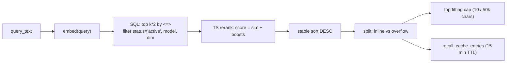

### Lifecycle transitions

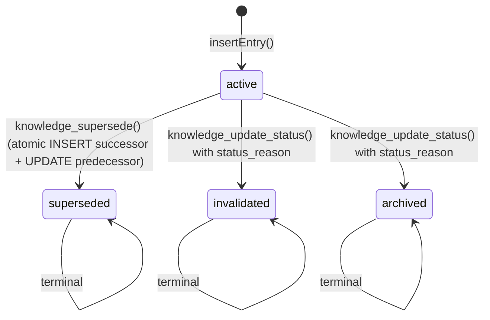

Single-successor lineage is enforced by partial unique index on `supersedes_id`. `active` is never re-entered: agents write a new entry instead.

### Hot context

The "Active Knowledge" block in the system prompt is built from:

1. **Active entries** (top 12 by `pinned DESC, updated_at DESC`), filtered to `status='active'`, `source IN ('observed', 'user_confirmed')`, `(pinned=true OR valid_until > now())`. Summarized to first 200 chars per entry, capped to 3000 total chars (`db/repos/knowledge/hot-context.ts:26-56`).
2. **Known kinds** (top 30 kinds by count in the above set).

The partial index `idx_ke_active_hot_source` (migration 018) supports this query efficiently. Hot context is a fixed, lightweight query (no embeddings, no ranking); recall is on-demand and vector-driven.

### Content hash dedup

`content_hash = SHA256(lengthPrefixed(kind|title|summary|content_md))` (`content-hash.ts:29-37`). Repeat writes return the existing row with `inserted=false`; tags, confidence, pinned, TTL, source_refs, and status are not silently updated on conflict. Metadata changes require dedicated tools (`knowledge_update_tags`, etc.) or a `supersede` if the change is significant.

### Key design decisions

1. **Agent-defined kinds, no static enum.** Avoids foreclosing what agents track. The "Known kinds" surface encourages organic convergence without code changes.
2. **No kind weights in ranking.** Ranking is purely empirical (similarity, recency, confidence, pinned). Sidesteps "which kinds matter" decisions that depend on the mission.
3. **Pinned overrides TTL, irreversibly.** Pinning sets `valid_until=NULL`. Unpinning requires explicit tooling. Avoids silent expiry of high-value rules.
4. **Cross-session by design.** Lineage preserved via `source_session` audit, but recall is not scoped to the current session.
5. **Confidence is agent-self-reported.** Not derived from ground truth. The 0.10 cap keeps confidence from dominating similarity.
6. **Immutable text, mutable metadata.** `content_hash` UNIQUE freezes the row's text fields; tags, pinned, confidence, source_refs can be updated through dedicated paths. Atomicity is reserved for `supersede`.
7. **Verified vs hypothesis gated at prompt level.** Only `observed` and `user_confirmed` enter hot context. Hypotheses remain recallable; this prevents "agent stored its own guess as a durable preference".

### Gotchas

1. Content-hash drift orphans old rows. Rewriting an entry with a changed summary inserts a new row; the old row stays `active` unless archived. Intentional replacement should use `knowledge_supersede`.
2. Expiry is a query filter, not a state transition. Expired entries persist and become live again if `valid_until` is extended or the row is pinned.
3. Partial unique on `supersedes_id` rejects concurrent supersede attempts on the same predecessor with `predecessor_already_superseded`.
4. Recall must filter `embedding_model` and `embedding_dim` before `<=>`; mixed-dimension vectors crash the operator.
5. Hot-context entries are not heavily truncated. A knowledge base of many large pinned entries can bloat the system prompt. The 3000-char soft target is exceeded by pinned content if the agent over-pins.
6. SQL fetches `k*2` candidates; rerank may drop some via `activeOnly` filter, so the handler must not assume `len(result)==k`.

---

## Tools registry, dispatcher, and internal tools

### Purpose

The tools layer is the agent's action surface. Three components: the registry holds every `ToolDef` with its metadata (name, description, JSON schema, mutating flag, pressure-safety class), the dispatcher routes each call to a handler while enforcing permission and pressure gates, and the internal handlers (lazy-loaded modules in `tools/internal/`) implement the agent-facing operations.

### ToolDef contract

```typescript
export interface ToolDef {
  name: string;                    // unique id; matches LLM tool_calls
  description: string;             // LLM-facing brief
  parameters: JsonSchema;          // JSON Schema; arrays require `items`
  kind: "internal" | "protocol";   // internal = in-process; protocol = via discover + execute
  mutating: boolean;               // permission-gated
  pressureSafety: PressureSafety;  // REQUIRED: "read_only" | "safe_at_barrier" | "mutating" | "compact_only"

  proactive?: boolean;             // hidden from agent (one-shot) mode by default
  requiresEnv?: string;            // ENV gate (tool hidden if not set)
  showOnlyWhenEnvMissing?: string; // inverse: hidden if ENV IS set
  excludeRoles?: string[];         // hard exclusion at dispatch
  surface?: "agent" | "mcp" | "both";
  visibility?: ToolVisibility;     // session/band/mission gating rules
}
```

`pressureSafety` is mandatory and orthogonal to `mutating`. A read operation may still be classified `mutating` for pressure purposes (e.g., `knowledge_write` is permission-safe but defers at barrier).

### Tool catalog (internal)

Selected tools registered in `tools/registry/*.ts`:

| Tool | Domain | Mutating | Approval | File |
|------|--------|----------|----------|------|
| `vex_introduction` | vex | no | no | `registry/vex.ts:25-44` |
| `vex_namespace_tools` | vex | no | no | `registry/vex.ts:46-64` |
| `web_research` | web | no | no | `registry/web.ts` |
| `twitter_account` | twitter | no | no | `registry/twitter-account.ts` |
| `document_read` `document_list` | documents | no | no | `registry/documents.ts:12-52` |
| `document_write` `document_delete` | documents | no | yes | `registry/documents.ts:28-64` |
| `knowledge_recall` `knowledge_recall_overflow` `knowledge_get` `knowledge_lineage` `knowledge_history` | knowledge | no | no | `registry/knowledge.ts` |
| `knowledge_write` `knowledge_supersede` `knowledge_update_status` | knowledge | no | yes | `registry/knowledge.ts:14-123` |
| `memory_recall` `mark_outstanding_resolved` | memory | no | no | `registry/memory.ts:23-89` |
| `portfolio_inspect` | portfolio | no | no | `registry/portfolio.ts:9-34` |
| `khalani_chains_list` `khalani_tokens_top` `khalani_tokens_search` `khalani_tokens_balances` | khalani | no | no | `registry/khalani.ts:16-35` |
| `mission_draft_update` | mission | no | yes | `registry/mission.ts:10-29` |
| `mission_stop` | mission | no | no | `registry/mission.ts:31-42` |
| `loop_defer` | autonomy | no | yes | `registry/autonomy.ts:64-98` |
| `tool_output_read` | autonomy | no | no | `registry/autonomy.ts:30-62` |
| `evm_read` | evm | no | no | `registry/evm.ts:9-19` |
| `wallet_read` | wallet | no | no | `registry/wallet.ts:12-18` |
| `wallet_send_prepare` | wallet | no | yes | `registry/wallet.ts:20-29` |
| `wallet_send_confirm` | wallet | yes | yes | `registry/wallet.ts:31-38` |
| `compact_now` | compact | no | no | `registry/compact.ts:17-68` |
| `discover_tools` `execute_tool` | protocol | varies | meta | `registry/protocol.ts` |

### Visibility filtering

`ToolVisibilityContext` (`registry.ts:34-41`):

```typescript
export interface ToolVisibilityContext {
  permission: Permission;              // "restricted" | "full"
  role: "parent" | "subagent";
  sessionKind: SessionKind;            // "agent" | "mission"
  missionRunActive: boolean;
  contextUsageBand: ContextUsageBand;  // "normal" | "warning" | "barrier" | "critical"
}
```

`getVisibleToolDefs` (`registry.ts:151-160`) applies filters in order:

1. Env gates (`requiresEnv`, `showOnlyWhenEnvMissing`).
2. Mode gates (`proactive`: hidden from agent mode by default).
3. Role gates (`excludeRoles`: subagent cannot see `mission_stop`, `loop_defer`, parent-spawn tools).
4. Session visibility (`visibility` field: band gates, setup-vs-run gating).
5. Pressure-safety filter (`registry.ts:188-194`): at barrier/critical, only `read_only`, `safe_at_barrier`, `compact_only` visible. `compact_only` is visible only at those bands.
6. Surface filter (`agent` / `mcp` / `both`).

The same context drives the LLM tool array and the in-prompt tool catalog, eliminating drift.

### Dispatcher flow

```mermaid
sequenceDiagram
    participant Loop as turn loop
    participant Disp as dispatcher.ts
    participant Reg as registry
    participant Appr as approval store
    participant H as handler

    Loop->>Disp: dispatchTool(toolCall, ctx)
    Disp->>Disp: checkPressureDeny() (mutating at barrier/critical)
    Disp->>Disp: routeToolCall()
    alt protocol meta-tool
        Disp->>Disp: route to protocol runtime
    else internal
        Disp->>Reg: isToolBlockedForRole()
        Disp->>Reg: isInternalTool(name)
        Disp->>Disp: approval gate (mutating + restricted + !approved)
        alt approval required
            Disp->>Appr: enqueue pending
            Disp-->>Loop: {pendingApproval: true}
        else allowed
            Disp->>H: lazy import handler
            H->>H: execute
            H-->>Disp: ToolResult
            Disp-->>Loop: {success, output, data, engineSignal?}
        end
    end
```

Pressure denial returns a synthetic error pointing the agent at `compact_now`. Approval queue persistence and `approveAndResume` / `rejectApproval` live in the engine.

### Internal tool handlers

`tools/internal/` holds ~30 handler files. Each is `async (params, context) => ToolResult`. Handlers are lazy-imported via `INTERNAL_TOOL_LOADERS` (`dispatcher.ts:194-264`); a dispatched tool loads only its module. Notable handlers: `documents.ts`, `knowledge/*.ts`, `memory/recall.ts`, `memory/mark-resolved.ts`, `portfolio-inspect.ts`, `wallet/read.ts`, `wallet/send.ts`, `mission.ts`, `loop-defer.ts`, `tool-output-read.ts`, `compact/now.ts`. Subagent handlers are defined but commented out in the loader map (`dispatcher.ts:249-255`), keeping the seam intact.

### Key design decisions

1. **Lazy-loaded internal tools via data-driven map.** Flat `Record<string, async import>` instead of a switch. `registry-completeness.test.ts` asserts every `ToolDef` with `kind: "internal"` has a loader entry.
2. **JSON Schema inline in registry.** Keeps registration lightweight and independently versionable from system prompts. Handlers parse defensively with safe accessors (`str`, `num`, `bool`, `enumField` in `internal/types.ts:72-102`).
3. **Visibility context drives both catalogs.** One pass produces both the provider tool array and the in-prompt tool map. Drift between the two was a known failure mode.
4. **Mutating and pressureSafety are orthogonal.** Permission gating is band-independent; pressure gating is permission-independent.
5. **Subagent seam left in place.** Subagent tools are declared but not loaded. Re-enabling the runtime does not require dispatch-layer changes.

### Gotchas

1. `pressureSafety` is enforced at the type level only. A mis-classified read tool (e.g. `pressureSafety: "mutating"` on a read) compiles fine. `registry.test.ts:165-171` covers part of this; CI should run typecheck + tests before commit.
2. Khalani internal tools are generated from the protocol manifest; if the manifest grows a mutating tool, the registry generator throws.
3. `InternalToolContext.approved` is immutable per dispatch. A handler waiting for sub-operation approval must return pending and let the engine re-invoke on the next turn.
4. Lazy imports catch module-load errors at dispatch time (`dispatcher.ts:99-110`). Always test handler modules independently to surface cyclic imports.
5. `surface: "agent"` hides a tool from the MCP catalog but does not block dispatch if a call somehow arrives. Defense in depth for `mission_stop` and `loop_defer`.

---

## Protocol runtime

### Purpose

The protocol runtime exposes external tools (Khalani, Solana, KyberSwap, Polymarket, bridges, predictions) to the agent through two meta-tools: `discover_tools` and `execute_tool`. The meta-tool pattern keeps the system prompt small: 30+ protocol tools do not each take a tool-array slot, and parameter schemas are discovered at runtime instead of baked into the prompt. Discovery uses dense embedding search with lexical fallback; execution applies lifecycle, environment, pressure, and approval gates before invoking the handler.

### Discover flow

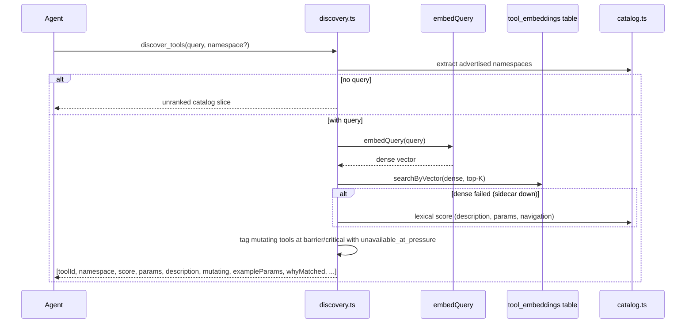

The pressure advisory (`unavailable_at_pressure: true`) was added in PR3-final to give the LLM a soft signal before it tries `execute_tool` on a mutating tool at high pressure (`discovery/types.ts:134-157`, `discovery.ts:36-42`).

### Execute flow

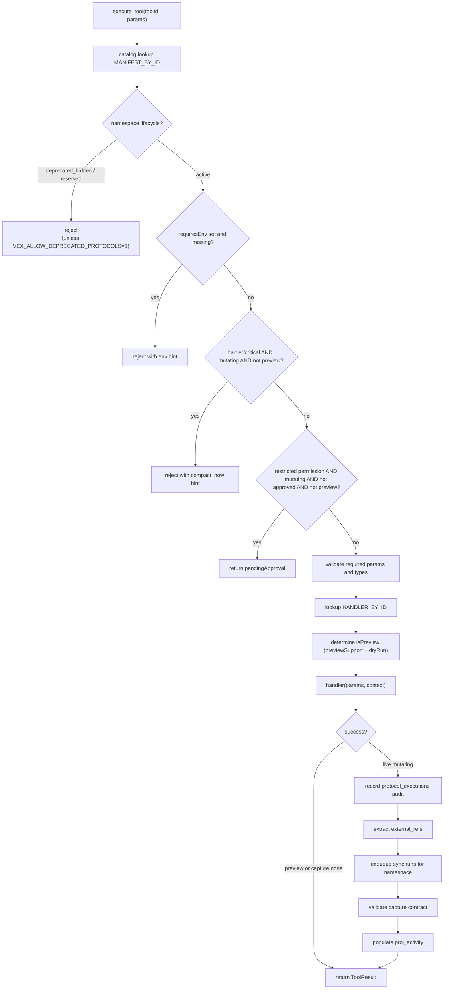

### Protocol catalog contract

`catalog.ts:58-75` maps namespaces to manifests and handlers. Each namespace exports `NAMESPACE_TOOLS[]` (array of `ProtocolToolManifest`: toolId, namespace, lifecycle, description, mutating, params, exampleParams, requiresEnv, discovery metadata) and `NAMESPACE_HANDLERS` (`Record<toolId, handler>`).

At module load (`catalog.ts:82-103`) the runtime builds `MANIFEST_BY_ID` and `HANDLER_BY_ID` maps. Duplicate `toolId` across namespaces throws immediately. Every namespace must appear in `NAMESPACE_MODULES` and have a row in `NAMESPACE_LIFECYCLE`. Adding a protocol is: one row in `NAMESPACE_MODULES`, one folder with manifest + handlers, list tools in the array, register handlers in the record. No hand-edited spread tables.

### Mutation matrix

`mutation-matrix.ts:1-136` is the single source of truth for capture contracts. Every mutating protocol tool has exactly one `MutationContract`:

```typescript
{
  role: "pnl_spot" | "pnl_prediction" | "projection" | "audit" | "utility",
  capture: "full" | "none",
  expectedType: string | string[],
  previewSupport: boolean,
  fanOut: "single" | "items",
  requiredFields: string[],
  exceptions?: {...},
  valuationExpected: "exact" | "conditional" | "none",
  requiredMetaFields?: string[],
}
```

The matrix is static at build time. `capture-contract.test.ts` enforces 1:1 coverage: every mutating tool in `PROTOCOL_TOOLS` appears exactly once; non-mutating tools must not appear; phantom entries fail.

### Capture validator

`capture-validator.ts:1-150` runs after a mutating handler returns. `validateCaptureContract(toolId, tradeCapture)`:

1. Look up the contract; if `capture:"none"`, return true.
2. Hard-fail if `capture:"full"` and `tradeCapture` is null.
3. Verify `expectedType` matches actual `_tradeCapture.type`.
4. Verify every `requiredField` is present (with named exceptions, e.g. neutral swap has no `tradeSide` when `meta.stableSwap=true`).
5. Verify `requiredMetaFields`.
6. For `valuationExpected:"exact"`, hard-fail if both `inputValueUsd` and `outputValueUsd` are missing or `valuationSource="none"`.

Failures are logged as errors, not silently filled with nulls. Failed captures do not enter `proj_activity`.

`isPreviewExecution` (`capture-validator.ts:143-149`) returns true if the contract declares `previewSupport=true` and `params.dryRun=true`. Preview executions skip capture, approval, and projection.

### Telemetry

Discovery emits structured events (`discovery.telemetry.ts:62-96`):

- `tools.discover.completed` or `tools.discover.empty`
- Fields: `discoveryRunId` (UUID), `sourceSurface`, `sourceSession`, `query` (privacy-filtered by `DISCOVERY_QUERY_PRIVACY` env), `queryPrivacy` mode, `namespace`, `limit`, `count`, `totalCount`, `hasMore`, `topToolId`, `topScore`, `matchedToolIds` (capped at 5), `retrievalMethod` (dense / lexical / catalog), `denseFailed`, `embeddingModel`, `embeddingDim`, `candidateCount`.

Privacy modes: `raw` (dev only), `normalized` (trimmed+lowercased), `sanitized` (alphanumeric tokens), `hashed` (SHA256 first 16 hex).

Execution events (`runtime.ts:150-180`): `protocol.execute.completed`, `protocol.execute.failed`, `protocol.execute.pressure_denied`, `protocol.execute.approval_required`, `protocol.execute.namespace_blocked`, `protocol.execute.capture_failed`. PR3-telemetry (commit e2dd409) standardized dotted event names across the runtime.

### Key design decisions

1. **Meta-tool pattern.** Two fixed tools instead of registering all protocol tools directly. Saves system-prompt budget and lets the parameter schema for any tool be discovered at runtime.
2. **Dense discovery with lexical fallback.** Embeddings capture intent (`"move USDC between chains"`) better than keywords; lexical fallback keeps discovery working through embedding-sidecar outages.
3. **Preview / dryRun isolation.** Mutating tools with `previewSupport=true` can return simulated results without approval or capture side effects. Lets the agent cost out decisions iteratively.
4. **Manifest registry as plug-in seam.** Adding a protocol is one folder. Discovery and runtime are unaware of namespace details.
5. **Synchronous capture validation.** Validation runs in the same call that emits the capture, before projections see it. Bad captures cannot corrupt downstream state.

### Gotchas

1. Dense discovery hits an external embedding service (~500 ms latency). Stale or absent embeddings trigger lexical fallback automatically (`denseFailed` in telemetry).
2. Pressure barrier on protocol mutating tools mirrors the internal flow: blocked unless `dryRun=true`. The advisory in discover output is a hint; the hard-deny is at execute time.
3. Approval is enforced at the handler boundary. The agent cannot bypass it by calling `execute_tool` directly.
4. Mutation-matrix gaps fail capture validation open (`capture-validator.ts:24`). The structural test prevents this from landing in production.
5. External refs extraction is opportunistic (`capture-pipeline.ts:17-53`). Tools that do not emit a tx hash or order id still pass; correlation simply degrades for those rows.

---

## Database layer

### Purpose

Vex Agent runs a dedicated local Postgres instance (port 5777, Docker Compose stack) holding all canonical application state: sessions, messages, mission runs, knowledge entries with embeddings, session memory chunks, the approval queue, protocol executions, portfolio projections, and audit. The MCP server and vex-agent engine consume this database directly; the vex-app renderer accesses it through IPC, not by importing repos. pgvector powers semantic search on `knowledge_entries`, `session_memories`, and `tool_embeddings`.

### Client and transaction pattern

`db/client.ts:1-118` exposes a singleton pool (max 10 connections, 30s idle timeout) configured from `VEX_DB_URL`. Two API tiers:

- `queryWith<T>(executor, sql, params)` / `queryOneWith<T>` / `executeWith` accept an explicit `Executor` (Pool or PoolClient). Callers inside a transaction pass their PoolClient.
- `query<T>` / `queryOne<T>` / `execute` delegate to the pool for non-transactional sites.

```typescript
type Executor = Pool | PoolClient;  // both expose .query(sql, params)
```

The compact service uses the tx-aware path so Track 1 archive + generation bump + Track 2 enqueue commit atomically. Maintenance-lease writers use it for the gate / writer coordination. Most other repos use the implicit pool. Pool errors are logged structured and non-fatal so a transient failure cannot crash the service through pool exhaustion.

### Migration runner

`db/migrate.ts:1-52` delegates to a shared runner at `src/lib/db/migrate-runner.ts:1-236` that is also consumed by the vex-app main process. Strategy:

- Forward-only. No down migrations. `schema_version` rows are not deleted.
- Files discovered by `NNN_` prefix (zero-padded), sorted lexicographically, applied only if `version > current`.
- Each migration runs inside a transaction; failure rolls back and throws `MigrationError` with version, file, cause.
- Advisory lock id `1_985_229_328` (30s acquisition timeout) serializes concurrent processes (Electron main, MCP, integration tests).
- Per-migration statement timeout: 5 minutes.

### Migration index

| Ver | File | Purpose | Owned by |
|-----|------|---------|----------|
| 001 | `initial.sql` | soul, knowledge_entries, messages, sessions, mission_runs, protocol_executions, tool_embeddings base, approval_queue, usage | core |
| 002 | `engine_missions.sql` | missions, mission_runs, message metadata (source, type, visibility, origin_session_id) | engine |
| 003 | `w4_pnl.sql` | pnl, lots, matches | portfolio |
| 004 | `w4_full.sql` | open_positions, portfolio snapshots, historical | portfolio |
| 005 | `lp_economics.sql` | lp_events, lp_pool_txs | portfolio |
| 006 | `knowledge_lifecycle.sql` | supersedes_id, status_reason, change_summary, what_failed; single-successor partial unique | knowledge |
| 009 | `maintenance_leases.sql` | singleton write-gate (FOR UPDATE / FOR SHARE) | core |
| 010 | `tool_embeddings.sql` | tool_embeddings (vector + audit + content_hash) | tools |
| 011 | `loop_wake_requests.sql` | per-session wake rows; one pending per session via partial unique | engine |
| 013 | `tool_output_blobs.sql` | overflow blob storage | tools |
| 014 | `proj_balances_chain_id_bigint.sql` | INTEGER -> BIGINT type bump | portfolio |
| 015 | `operator_interrupts_and_recovery.sql` | operator interrupts, recovery state | engine |
| 016 | `session_memories.sql` | per-session narrative chunks, outstanding_items JSONB, dedup hash, body hash | memory |
| 017 | `compact_jobs.sql` | Track 2 outbox, retry state, heartbeat, claim ownership | memory |
| 018 | `knowledge_source.sql` | source column (observed / user_confirmed / inferred / hypothesis), composite hot-context partial index | knowledge |

### Schema overview

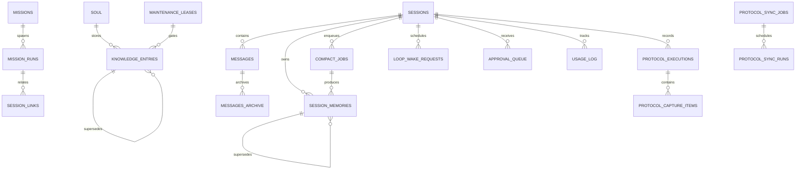

Tables grouped by responsibility:

- **Identity / memory**: `soul`, `knowledge_entries` (with `embedding`, `embedding_model`, `embedding_dim`, lineage), `session_memories`.
- **Session / message**: `sessions` (`mode`: agent / mission, `permission`: restricted / full, `checkpoint_generation`), `messages`, `messages_archive`, `session_links`.
- **Compaction**: `compact_jobs` (outbox with retry, locked_at / locked_by, heartbeat_at).
- **Mission**: `missions`, `mission_runs` (`status`: running / paused_* / stopped / completed, `stop_reason`).
- **Autonomy**: `loop_wake_requests` (one pending per session via partial unique), `approval_queue` (tool_call JSONB, pending_context JSONB for round-trip).
- **Protocol execution**: `protocol_executions` (audit with `external_refs` JSONB keyed by namespace), `protocol_capture_items`, `protocol_sync_jobs`, `protocol_sync_runs`.
- **Portfolio projections**: `proj_balances` (wallet x token x chain), `proj_open_positions`, `proj_portfolio_snapshots`.
- **Tool discovery**: `tool_embeddings` (mirrors knowledge_entries schema, `tool_id` PK, `content_hash` for idempotent reembed).
- **Cost / audit**: `usage_log` (tokens, cost, cache, reasoning), `billing_snapshots`, `runtime_cycles`.
- **Coordination**: `maintenance_leases` (singleton id=1 CHECK; reembed acquires FOR UPDATE, writers acquire FOR SHARE and fail fast if active), `runtime_state`.
- **Metadata**: `folders`, `documents` (markdown scratchpad with soft delete), `recall_cache_entries` (overflow TTL), `inbox_events`.

### Repo conventions

Repos live in `db/repos/`. Conventions:

- One file per aggregate; complex aggregates get a folder with `index.ts` public re-exports.
- Input / output types defined inline; Zod validation at write boundaries.
- Naming: `get(id)`, `list()`, `create(input)`, `update(id, input)`, `claim(...)` for exactly-once selectors via `FOR UPDATE SKIP LOCKED`.
- Tx-aware functions accept `executor: Executor`.
- `mapRow()` helpers normalize DB rows to typed domain objects with defensive coercion (e.g. `sessions.ts:76-107`).
- JSONB serialized through `jsonb()` / `nullableJsonb()` (`params.ts:14-24`) which validate circular references and sanitize `undefined` / `BigInt`.
- Errors: log unexpected values, throw on invariant violations, return null for missing rows.

### pgvector usage

Three tables use pgvector (0.8.2-pg18 in the Docker image):

1. **`knowledge_entries`** (migration 001). Vector column with no typmod (i.e. `vector`, not `vector(1536)`). Per-row `embedding_dim` is authoritative. CHECK constraints: `embedding_dim > 0 AND embedding_dim <= 8192`, `vector_dims(embedding) = embedding_dim`. Partial indexes on `(status, valid_until DESC)`, `(kind)`, `(pinned)`. No ANN index; brute-force cosine scan is acceptable for current scale.
2. **`tool_embeddings`** (migration 010). Same pattern, plus `content_hash` for idempotent reembed (`formatter_version|tool_id|namespace|source_text|aliases|exampleIntents|chains`).
3. **`session_memories`** (migration 016). Same embedding contract, with `content_hash` on the immutable narrative core. Cosine scoped to `status='active'` plus mandatory model + dim filter. No ANN; per-session scoping keeps result sets small.

No ivfflat / hnsw indexes exist. ANN is deferred until scale warrants it.

### Key design decisions

1. **Executor abstraction.** `queryWith(executor, sql, params)` lets repos join an existing transaction or use the pool without API churn. Compact Track 1 commits archive + generation bump + Track 2 enqueue atomically thanks to this.
2. **Migration linearity + advisory lock.** Forward-only schema, single advisory lock id for all consumers. Crash recovery is unambiguous; no partial-state confusion.
3. **Vector column without typmod.** Lets the row store the actual dimension. Model dimension changes do not require destructive migration; re-embed creates new rows and the old ones get superseded.
4. **Idempotent writes via content_hash.** UNIQUE / partial UNIQUE on `content_hash` makes insert-or-ignore a DB invariant. Embedding-service retries cannot duplicate rows.
5. **Partial unique indexes for NULL semantics.** Postgres treats `NULL <> NULL`, so partial unique indexes (`WHERE parent_id IS NOT NULL`, `WHERE status='pending'`) enforce uniqueness on the non-null subset (folders, documents, loop_wake_requests, session_memories).
6. **Maintenance-lease write-gate.** Reembed acquires `FOR UPDATE` on the singleton row and sets `active=TRUE`. Writers acquire `FOR SHARE` and fail fast with `MaintenanceActiveError`. Closes the TOCTOU window without per-writer advisory locks.

### Gotchas

1. **In-place migration edits are a trap.** Once a migration has been applied on any install, editing it retroactively breaks idempotency for installs that re-run from the persisted `schema_version`. Add a new migration that ALTERs instead. Commit d917d23 mentions an in-place 016 edit that landed only because no shipping install had applied it yet.
2. **Compact Track 2 enqueue requires tx context.** Archive + summary + generation bump + job enqueue must commit together. Without the Executor pattern they could race.
3. **`FOR UPDATE SKIP LOCKED` needs a tx.** `SELECT id ... FOR UPDATE SKIP LOCKED; UPDATE ... WHERE id = X` is only race-safe inside one BEGIN / COMMIT on one PoolClient.
4. **Embedding-dim filter is caller-side.** No CHECK can stop you from running `<=>` on mixed-dimension vectors; the recall code must filter `embedding_model` and `embedding_dim` before the operator.
5. **NULL vs `'{}'` in JSONB.** Use `jsonb('{}')` or `jsonb('[]')` for semantically empty JSONB columns. `nullableJsonb()` is for genuinely optional columns. The `sanitizeJsonbValue` helper rejects `undefined`, `BigInt`, and circular references at bind time.

---

## Embeddings, inference, sync, and wake

### Purpose

These four subsystems form the infrastructure layer under the agent. Embeddings convert text to vectors; inference routes LLM calls to OpenRouter; sync refreshes portfolio state from on-chain sources on a fixed cadence; wake is a database-claimed scheduler for deferred resumes.

### Embeddings

`embeddings/client.ts:101-136` is an OpenAI-compatible HTTP adapter (`POST {baseUrl}/embeddings`). It exports `embedDocument`, `embedQuery`, `embedTool`, all routed through `callEmbeddingsEndpoint` (`client.ts:164-210`).

Formatter contract (hardcoded, `client.ts:57-70`):

- Document: `"title: {title} | text: {summary}"`
- Query: `"task: search result | query: {query}"`

`FORMATTER_VERSION = "v1-gemma-title-text"` (`client.ts:57`). Bumping this invalidates every embedding row via content-hash audit, so swapping model families (Gemma -> BGE / E5 / Qwen / Nomic) is an explicit migration.

Critical contract: callers must stamp the **provider-returned** model (not config.model) into `embedding_model`. Read and write paths must agree on the audit source; misalignment breaks recall silently.

Config (`embeddings/config.ts:40-93`): validates `EMBEDDING_BASE_URL` (http / https, no trailing slash), `EMBEDDING_MODEL`, `EMBEDDING_DIM` (integer in [1, 8192]), `EMBEDDING_PROVIDER` (tag for logs). Errors aggregated and thrown together. HTTP timeout 30s, 2 retries with 1 to 5 second backoff.

### Inference

`inference/registry.ts` is a concurrency-safe singleton with generation tokens deduplicating parallel resolve calls. Priority: explicit `AGENT_PROVIDER`, then `OPENROUTER_API_KEY` (auto-detect), then null (agent will not start).

`inference/openrouter.ts` wraps the SDK with:

- `loadConfig` (`openrouter.ts:98-158`): `client.models.list()`, find configured model, extract input / output / cache / reasoning pricing.
- `chatCompletion` (`openrouter.ts:162-179`): non-streaming, tool-aware.
- `chatCompletionSimple` (`openrouter.ts:183-205`): no tools.
- `chatCompletionStream` (`openrouter.ts:209-275`): streaming with tool-call accumulation.
- `getBalance` (`openrouter.ts:279-324`): management key first, falls back to regular key metadata. Returns null on both failures; the caller treats null as unbounded.
- `calculateCost` (`openrouter.ts:328-353`): cost from usage and pricing, including cache savings and reasoning surcharge.

SDK config: 2s initial backoff, 15s max, 2x exponent, 60s total timeout (`openrouter.ts:84-93`). Low-balance threshold $5 USD (`openrouter.ts:42`).

`inference/schema-normalizer.ts` is a pure mutation-free bridge for strict-mode compliance: it injects `items: { type: "string" }` on bare arrays and `additionalProperties: false` on objects with properties. Single source of truth for tool-schema normalization across providers.

`inference/config.ts` loads `AGENT_PROVIDER`, `OPENROUTER_API_KEY`, `AGENT_MODEL`, `AGENT_CONTEXT_LIMIT`, `AGENT_TEMPERATURE`, `AGENT_MAX_OUTPUT_TOKENS`. Hardcoded internals: streaming timeout 5 min, non-streaming 2 min, balance cache TTL 30s, OpenRouter SDK timeout 5 min, inference retry 2 attempts with 2 to 15 s backoff.

### Sync executor

`sync/executor.ts` is a separate long-lived process that wakes every 60 s.

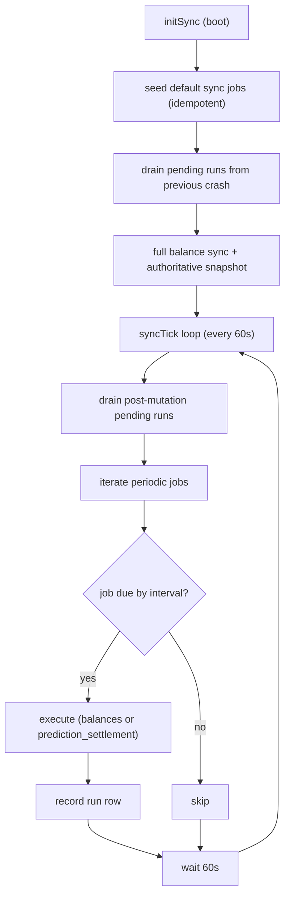

Balance sync (`balance-sync.ts:39-99`): for each configured wallet family (EVM or Solana), fetch token balances via Khalani, replace per-chain transactionally (transactional full-replace deletes absent tokens), compute total USD, return counts.

Projectors:

- **LP** (`projectors/lp.ts`): zap-in opens a position with cost basis; zap-out closes; zap-migrate carries the cost basis to the new pool. LP legs extracted from ZaaS zapDetails (action -> leg type: addLiquidity / removeLiquidity / protocolFee / refund).
- **Spot** (`projectors/spot.ts`): buy opens a FIFO lot; sell matches lots FIFO with `FOR UPDATE` on lot rows to prevent concurrent sell races. PnL is computed later during export.
- **Mark-to-market** (`sync/mtm.ts`): for open prediction positions, fetch exit prices from Jupiter (Solana) or Polymarket CLOB (public endpoint), dedup by `marketId`, update `current_value_usd = contracts * markPrice`.

Sync is started only from the MCP binary (`src/mcp/index.ts`) after transport bind, with no env-driven kill switch.

### Wake executor

`engine/wake/executor.ts` drives `loop_defer` resumes. Single-instance via `FOR UPDATE SKIP LOCKED`:

1. `claimDue(now, batchSize)` (`executor.ts:84`) atomically flips pending rows to `consumed` and returns them.
2. For each claimed row, re-check the mission run status; if still `paused_wake`, acquire claim with a CAS, inject a `wake_due` banner into the message stream, and resume the run (`executor.ts:106-138`).
3. Rows the executor cannot handle (run drifted, user preempted) are logged and skipped; the claim is terminal.

Defaults: interval 2000 ms, batch size 10. No env override (`AGENT_WAKE_ENABLED` is intentionally not respected; a stale install cannot accidentally disable wake). Startup logged; graceful shutdown drains in-flight tick before returning (`executor.ts:194-209`).

### Scripts

| Script | Purpose | When to run |
|--------|---------|-------------|
| `knowledge-export.ts` | stream `knowledge_entries` as JSONL backup (no vectors, portable across model swaps) | disaster recovery, before model change |
| `knowledge-import.ts` | restore JSONL backup, re-embed locally, idempotent on content_hash, preserve audit | post-model-change re-ingest |
| `knowledge-reembed.ts` | refresh embeddings in place when the model changes (same-dim only; acquires maintenance lease) | dev iteration, model optimization |
| `tool-reembed.ts` | populate / refresh `tool_embeddings` (idempotent on content_hash) | dev bootstrap before MCP start |
| `tool-embeddings-health.ts` | check `tool_embeddings` is populated, consistent with config model / dim / active tool count | pre-flight |
| `cross-lingual-benchmark.ts` | embed a curated 30-pair dataset, measure recall@1 / @3 and margin vs distractors in two modes (English-only vs native) | gate the cross-lingual pivot |

All scripts call `loadProviderDotenv()` first. Most run migrations. Export is read-only and does not call `loadEmbeddingConfig()` so it works when the embedding sidecar is down.

### Cross-lingual benchmark (Phase 0 gate)

`scripts/cross-lingual-benchmark.ts` embeds a fixed 30-pair dataset (5 languages x 6 topics, dataset in `cross-lingual-benchmark-dataset.ts:57+`). Each pair is `(query, doc_English, doc_native)`. Mode A tests native query against English doc (validates the cross-lingual pivot). Mode B tests native query against native doc (historical baseline).

Metrics per language per mode:

- Recall@1: target ranked #1 of ~30 candidates.
- Recall@3: target in top 3.
- Avg margin: mean of `targetScore - bestDistractorScore`. Positive = target wins.
- Min margin: worst case; may be negative.

Cosine recomputed from scratch (`cross-lingual-benchmark.ts:95-112`) so the metric is robust against unnormalized providers. Output is a markdown report (default `docs/benchmarks/cross-lingual-recall.md`) with per-pair results, per-language aggregates, and a worst-case section. No hard threshold is encoded; the operator reads the report and fills in a Verdict line.

### Key design decisions

1. **OpenAI-compatible embedding API.** Any provider that serves the OpenAI shape works: Hugging Face, Ollama, modal.com, local Docker. baseUrl + model are env-driven.
2. **Formatter pinned to model card.** Prompts are model-specific by design. Bumping `FORMATTER_VERSION` is an auditable migration; silent change is impossible because `content_hash` includes the version.
3. **OpenRouter for inference.** Provider flexibility at the LLM layer. The next provider is another factory in the registry.
4. **Single-instance sync and wake.** Both rely on DB-level row locks for exactly-once claim. Deploying N processes is safe; N-1 claim nothing.
5. **Sync is a separate process.** Not bound to a turn; runs independently. Portfolio state cannot lag a multi-turn session.
6. **Wake as a scheduler.** Wakes are DB rows, not JavaScript timers. Process restart does not lose scheduled resumes; resume flows through the standard banner injection path.

### Gotchas

1. Bumping `FORMATTER_VERSION` invalidates all embeddings. This is intentional; silent prompt-format changes would corrupt recall.
2. CLI scripts do not start the sync executor. If you run a script and expect fresh portfolio state, you will see stale numbers.
3. Wake banner text is user-visible and consumes prompt budget; keep it short.
4. OpenRouter low-balance returns null from `getBalance` if neither management nor regular key works. The caller treats null as unbounded.
5. Embedding service must be running for write paths. Knowledge writes and chunker inserts call `embedDocument`; if the sidecar is down, the operation fails after 2 retries.
6. Projectors run async after balance sync. If a projector crashes mid-flight, the activity row is left half-projected and must be manually reprocessed.

---

## Maturity markers

Vex Agent has been built in numbered, audited PRs. Recent commits surface the project's discipline around schema safety, observability, and post-merge audits:

- **PR2** introduced the two-track compaction model and the `compact_jobs` outbox. Migration 016 (`session_memories`) and 017 (`compact_jobs`) landed together.
- **PR3-clarity** (commit e2dd409 predecessor) reorganized prompt-stack composition: Tool Map, Memory Routing rule, ToolDef rewrites, tool-usage section.
- **PR3-telemetry** (commit e2dd409) added structured event names for the full compact lifecycle, plus Track 2, memory, and knowledge events. Event names are dotted and field names normalized across the runtime.
- **PR3-final** (commit d917d23) added the `discover_tools` pressure advisory, the `portfolio_inspect` doc surface, and the `body_md_hash` race fix (migration 016 was edited in place because no install had applied it yet; new installs always see the corrected schema).
- **PR4** (commit 751fb8c) sunset the deprecated `session_episodes` and `checkpoint_handoffs` tables and shipped the initial eval harness (5 of 18 scenarios).
- **PR5** (commit 88ea049) closed P1+P2+P3 audit findings from the cross-PR1-PR4 audit.

The project ships explicit audit followup commits, an eval harness, structured telemetry events, and forward-only migrations. Schema decisions are documented in migration headers; design decisions live next to the code they govern (`memory/policy.ts`, `knowledge/policy.ts`, `tools/protocols/mutation-matrix.ts`). The path from "agent emitted a tool call" to "row in the projection table" goes through named gates (visibility, pressure, approval, capture validation), each individually testable and observable.
