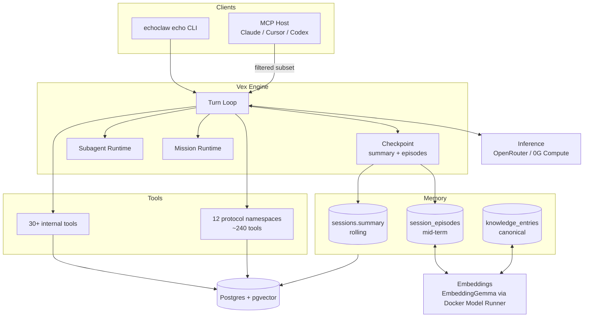
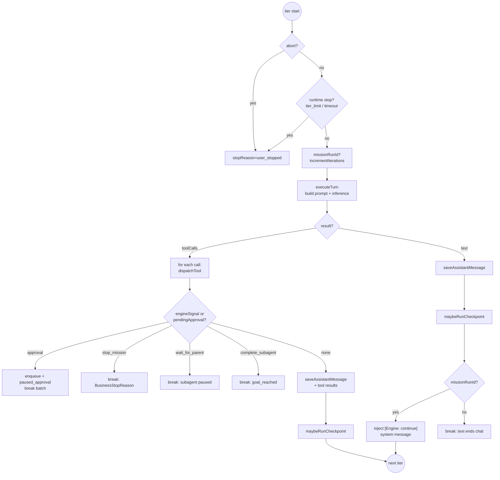
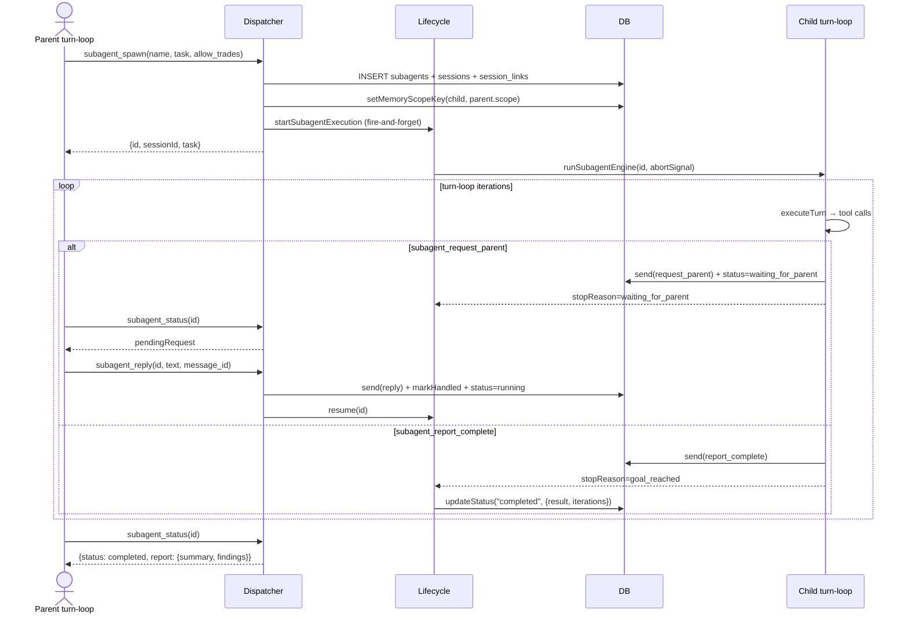
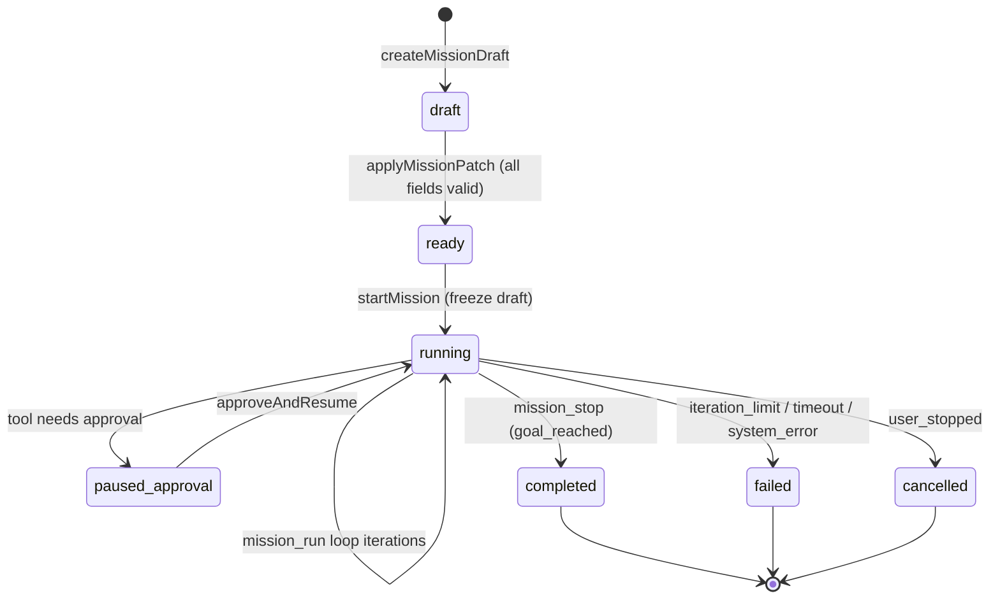
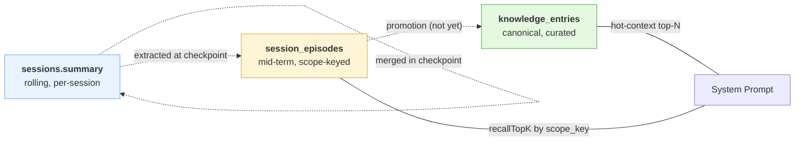
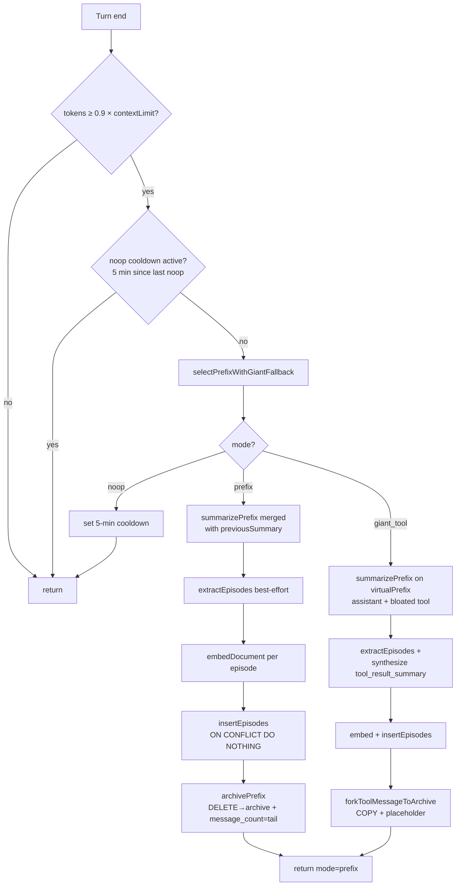
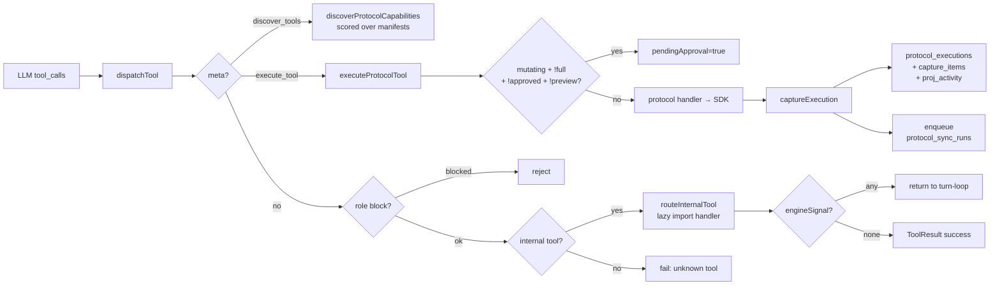
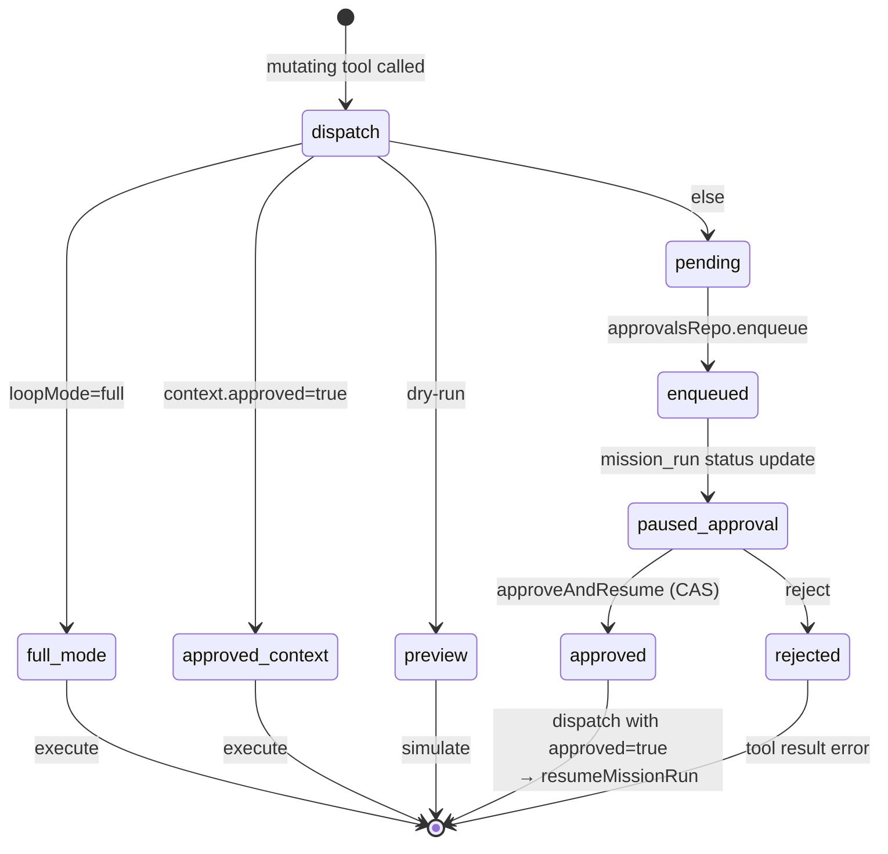
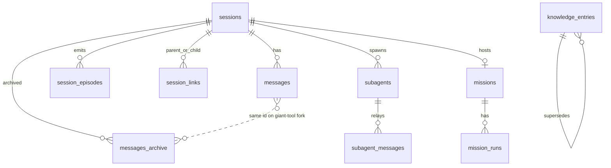

# Vex

Crypto-native autonomous agent — mission-driven, tool-using, memory-aware. Vex runs casual chat, multi-step missions with budget ceilings and approval gates, and spawns subagents with inherited memory scope. Three-tier memory (rolling summary → session episodes → canonical knowledge) keeps long conversations coherent without bloating the context window.

**Vex** is the agent. **EchoClaw** is the distribution: a CLI (`echoclaw echo`), a production MCP server (`echoclaw-mcp`), a bundled docker stack (Postgres + pgvector, Docker Model Runner for embeddings), and a growing protocol library — **12 namespaces, ~240 tools** across Solana, EVM, and off-chain REST.

## Status

Public npm package with local MCP launcher support. Primary entrypoints:

- `echoclaw echo` — guided local MCP setup + ready AI-agent connectors
- `echoclaw-mcp` — direct production MCP server entrypoint
- `echoclaw vex` — reserved for the future standalone VEX runtime

## Quickstart

```bash
npm add -g @echoclaw/echo
echoclaw echo
```

The guided `echo` flow:

- checks local runtime requirements,
- shows which `.env` values are already configured,
- fills bundled MCP defaults required for local bootstrap,
- configures local EVM + Solana wallets,
- starts the bundled local services,
- generates ready connector artifacts for Cursor, Claude Code, Codex, OpenClaw, and a default MCP client.

For npm publish, the package uses a dedicated release build that keeps the CLI fully functional while omitting sourcemaps and TypeScript declaration artifacts from the tarball.

## Architecture at a glance



Every session — chat, mission, subagent, or MCP — is a row in `sessions` with its own message log, rolling summary, and `memory_scope_key`. The engine is a single turn loop with mode-specific behaviour; the rest is support infrastructure.

Code roots:
- `src/echo-agent/engine/` — turn loop, checkpoint, subagents, missions, prompt stack
- `src/echo-agent/tools/` — internal tools + protocol adapters
- `src/echo-agent/db/` — migrations, repos, pool singleton
- `src/echo-agent/embeddings/` + `src/echo-agent/inference/` — network clients
- `src/mcp/` — production MCP server (`echoclaw-mcp`)
- `src/cli/` — `echoclaw echo` wizard + passthroughs

## Turn loop

The turn loop (`src/echo-agent/engine/core/turn-loop.ts:65`) drives every session — chat, mission setup, mission run, and subagent. Each iteration: check abort → check runtime stop (iteration limit / timeout) → execute one inference turn → dispatch any tool calls → deferred-save the canonical batch → run checkpoint if the session is under context pressure → continue or break.



**Mode differences:**

| Mode | Sessionkind | missionRunId | maxIterations | Text response |
|---|---|---|---|---|
| Chat | `chat` | null | 1 | Ends loop |
| Mission setup | `mission` | null | 5 | Ends loop → `applyMissionPatch` |
| Mission run | `mission` | set | 50 | Injects `[Engine: continue]`, keeps looping |
| Subagent | `chat` (inherits kind), `isSubagent=true` | null | `SUBAGENT_MAX_ITERATIONS` env | Same as chat unless engine signal fires |

**Deferred save** (the non-obvious bit): the assistant message is NOT saved by `executeTurn`. The turn loop collects dispatched tool calls, then saves the canonical assistant message with only the calls that actually entered dispatch (approval breaks and engine signals trim the tail). This keeps message history in sync with what the LLM will see on the next turn.

**Stop reasons** — Business (permanent): `goal_reached`, `deadline_reached`, `capital_depleted`, `max_loss_hit`, `no_viable_opportunity`, `user_stopped`. Runtime (resumable or fail): `approval_required`, `iteration_limit`, `timeout`, `waiting_for_parent`, `system_error`. Declared in `src/echo-agent/engine/types.ts:35-51`.

## Subagents

A subagent is a child session with its own turn loop running in a fire-and-forget background task. The parent dispatches `subagent_spawn` and gets an id back; the parent polls via `subagent_status` or receives a relayed text on the parent-side message bus. Memory scope inheritance means the child's checkpointed episodes feed the parent's recall.



**Key invariants:**
- **Memory scope inheritance** — child inherits parent's `memory_scope_key` at spawn (`src/echo-agent/tools/internal/subagent/parent.ts:55-60`). Child's episodes land in the same recall pool as the parent's. Opt-in isolation is reserved for a future release.
- **Loop mode clamp** — `allowTrades=false` pins the child to `restricted` mode regardless of parent mode. A child never exceeds parent privilege.
- **Role-based tool filter** — `subagent_spawn/status/stop/reply` are parent-only; `subagent_request_parent/report_complete` are child-only. Enforced via `excludeRoles` in the tool registry (`src/echo-agent/tools/registry.ts:107`).
- **Relay channel** — `subagent_messages` table carries `relay | request_parent | reply | report_complete`. Structured reports preserve evidence objects; plain relays are short text.

## Missions

Missions are a structured workflow on top of a session. Stage 1 (setup) collects 10 required fields via a free-form chat with validation; stage 2 (run) executes the frozen draft inside the turn loop with mission-specific prompt + `mission_stop` tool.



**Required mission fields** (`MISSION_DRAFT_REQUIRED_FIELDS`, `src/echo-agent/engine/types.ts:97-108`): title, goal, capitalSource, startingCapital, riskProfile, allowedWallets, allowedChains, allowedProtocols, successCriteria, stopConditions.

**`mission_stop` tool** — only emittable from within a mission run. Attached `BusinessStopReason` is what terminates the run. `user_stopped` arrives via AbortSignal, not this tool.

**Frozen draft** — at `startMission` the current draft is snapshotted via `freezeDraft`; subsequent mission-level edits don't leak into the running loop.

## Three-tier memory

Vex has three distinct memory surfaces, each with its own write + read path. Nothing is "the memory" — they cooperate.



| Tier | Table | Lifespan | Write path | Read path |
|---|---|---|---|---|
| Rolling summary | `sessions.summary` | per session | `summarizePrefix` at checkpoint, merged with previous summary | Injected as `[Previous conversation summary]` system block |
| Session episodes | `session_episodes` | mid-term, scoped by `memory_scope_key` | `extractEpisodes` → `insertEpisodes` with per-row embedding | `recallTopK` at turn start — top 5, min similarity 0.25, query translated to English first |
| Knowledge entries | `knowledge_entries` | long-term, curated, English-only | Explicit `knowledge_write` / `knowledge_supersede` tools | Hot context (pinned + recent) + `knowledge_recall` tool |

**Scope key rules:**
- **Chat session** → `memory_scope_key = sessionId` (fallback in `src/echo-agent/engine/core/hydrate.ts:66`)
- **Subagent** → inherits parent's `memory_scope_key` so child's episodes feed parent's recall
- **MCP session** → `mcp-{transport}-{id}` stamped at session creation (`src/mcp/sessions.ts`)
- **Episode → knowledge promotion** — intentionally NOT implemented in v1; flagged as follow-up in `src/echo-agent/db/migrations/007_session_episodes.sql:4-5`

**Episode kinds** (6): `decision | fact | preference | open_loop | tool_result_summary | lesson`.

**English-only invariant** — Gemma aligns best on English. Rolling summaries, episode `summary_en`, and every text-bearing JSONB field on episodes (`facts`, `decisions`, `open_loops`, `tool_outcomes`, `entities`) are written in English regardless of the source conversation language. Query translation runs at turn start via `chatCompletionSimple` before `embedQuery` so recall doesn't miss rows because the user spoke Polish.

## Checkpoint

The checkpoint is the mechanism that keeps a session's context under the model limit while preserving semantic continuity. It fires when `sessions.token_count ≥ 0.9 × contextLimit`. Three modes, chosen by `selectPrefixWithGiantFallback`:



**Thresholds** (`src/echo-agent/engine/core/checkpoint.ts`, `src/echo-agent/engine/checkpoint/prefix.ts`):
- `CHECKPOINT_THRESHOLD = 0.9` — fire at 90% of context limit
- `TAIL_WINDOW = 10` — keep last 10 live messages after prefix archive
- `GIANT_TOOL_THRESHOLD = 8_000` — tool outputs >8KB trigger giant-tool fallback
- `NOOP_COOLDOWN_MS = 5 min` — don't retry compaction on an empty session

**Prefix mode** — normal case. Partitions the live messages so no `assistant.tool_calls ↔ role:'tool'` pair splits across the cutoff, summarizes + extracts, then moves the prefix into `messages_archive`.

**Giant-tool mode** — triggered when a single bloated tool result is the sole source of pressure. The checkpoint COPIES the live row into archive (preserving the full payload), extracts a `tool_result_summary` episode pointing at the archived id, and replaces the live row's content with `[tool_result_summary#<id> — full payload archived at message_id=<mid>. Ask the operator for replay if needed.]`. The row stays live with the same id so `assistant.tool_calls` pairing doesn't break.

**Archive idempotency** — both archive inserts use `ON CONFLICT (id) DO NOTHING`, so giant-tool forks that later age into a normal prefix don't collide on the `LIKE INCLUDING INDEXES` unique index. `getAllMessages` prefers the archived canonical row over the live placeholder via `NOT EXISTS` in the UNION query.

## Tools & Protocols

Every LLM tool call goes through `dispatchTool` (`src/echo-agent/tools/dispatcher.ts:26`). Meta-tools `discover_tools` and `execute_tool` route to the protocol runtime. Everything else is either a parent/child role block or an internal tool — lazy-imported on demand.



### Internal tools (selected)

| Name | Namespace | Purpose |
|---|---|---|
| `discover_tools` | meta | Scored RAG-style search over protocol manifests (NOT embedding-based) |
| `execute_tool` | meta | Execute a discovered protocol tool by `toolId` + params |
| `knowledge_write` | knowledge | Write NEW canonical memory entry; embeds title+summary on write |
| `knowledge_supersede` | knowledge | Atomic replace of active entry + version lineage |
| `knowledge_recall` | knowledge | Semantic top-k over `knowledge_entries`; overflow to cache |
| `knowledge_recall_overflow` | knowledge | Read cached overflow by `cacheKey` (15-min TTL) |
| `knowledge_lineage` | knowledge | Walk root↔head version chain (recursive CTE) |
| `knowledge_history` | knowledge | Browse non-active entries by kind/status |
| `document_read/write/list/delete` | doc | Markdown notes in a folder tree (`documents` table) |
| `portfolio_inspect` | portfolio | 14-view DB read (positions, activity, lots, profits, LP, ...) |
| `web_search` / `web_fetch` | web | Tavily search + URL → markdown |
| `mission_stop` | mission | Engine signal `stop_mission` with `BusinessStopReason` |
| `subagent_spawn/status/stop/reply` | subagent | Parent-side subagent control |
| `subagent_request_parent/report_complete` | subagent | Child-side engine signals |
| `wallet_read/send_prepare/send_confirm` | wallet | Multi-chain read + 2-step transfer with approval gate |
| `evm_read` | evm | tx receipts / ERC20 metadata / balance queries |
| `schedule_create/remove` | scheduling | Cron tasks (NOT exposed to MCP) |
| `polymarket_setup` | setup | Derive CLOB creds; auto-hidden once `POLYMARKET_API_KEY` is set |

### Protocol namespaces

| Namespace | Chain | Purpose | Advertised |
|---|---|---|---|
| `khalani` | multichain (40+ EVM, Solana) | Cross-chain bridging + token registry | ✓ |
| `kyberswap` | 20 EVM chains | DEX aggregator swaps + limit orders + zap LP | ✓ |
| `solana` | Solana | Jupiter SDK: swap, lend, predict (perps) | ✓ |
| `polymarket` | Polygon | Prediction markets (bridge + CLOB + data + gamma + rewards) | ✓ |
| `dexscreener` | multichain read | Price/liquidity/trending/paid-orders research | ✓ |
| `echobook` | off-chain REST | Social trading platform (JWT auto-nonce) | ✓ |
| `chainscan` | 0G EVM | 0G block explorer (requires `CHAINSCAN_API_KEY`) | ✓ |
| `jaine` | 0G EVM | Jaine DEX (subgraph + on-chain) | ✓ |
| `slop` | 0G EVM | Bonding-curve token platform | ✓ |
| `slop-app` | off-chain REST | Slop social + discovery (Socket.IO) | ✓ |
| `0g-compute` | — | Reserved, no manifest yet | ✗ |
| `0g-storage` | — | Reserved, no manifest yet | ✗ |

Source: `src/echo-agent/tools/protocols/catalog.ts:33`. Handlers are thin adapters over the SDK directories in `src/tools/<protocol>/`.

### `discover_tools` — how it scores

Not RAG over `knowledge_entries`. `discoverProtocolCapabilities` (`src/echo-agent/tools/protocols/discovery.ts:82`) builds weighted search fields from each manifest:

| Field | Weight |
|---|---|
| `toolId` | 8 |
| `description`, `params.key`, `params.description`, `canonicalSummary` | 6–7 |
| `namespace`, `aliases` | 5 |
| navigation strings, `exampleIntents` | 4–6 |
| `exampleQueries` | 3 |

Score = `weight × (substring hit ? 6 : 0) + weight × tokenMatches + 12 bonus if every query token matched`. A bias adjustment adds ±5 based on `preferredFor` / `avoidFor` metadata once query coverage passes 40% of the catalog. Results are sorted desc, capped at `limit` (default 5).

## Approval gate

Mutating tool calls must be approved unless the loop is in `full` mode, the context already carries `approved:true` (arriving from the `approveAndResume` flow), or the call is a dry-run preview.



**Entry points** — protocol tools gated by `MUTATION_MATRIX` (`src/echo-agent/tools/protocols/mutation-matrix.ts`); internal gate in `src/echo-agent/tools/internal/wallet/send.ts:122` for `wallet_send_confirm`.

**Queue** — `approval_queue` table. `approvalsRepo.approve` does an atomic CAS `WHERE status='pending'` so a double-click can't double-execute. When the mission resumes, `approveAndResume` (`src/echo-agent/engine/core/resume.ts:27`) dispatches the approved tool with `approved:true`, saves the tool result, flips `paused_approval → running`, and re-enters the mission run loop via a lazy-imported `resumeMissionRun`.

## Inference

Two providers live side-by-side: OpenRouter (SDK) and 0G Compute (raw fetch). Selection order at boot (`src/echo-agent/inference/registry.ts:41-108`):

1. `AGENT_PROVIDER` env — explicit override, fail-fast on unknown value
2. `OPENROUTER_API_KEY` present → OpenRouter
3. `compute-state.json` exists (on-chain broker ready) → 0G Compute
4. Neither → refuse to start

The resolved provider is cached as a singleton for the process lifetime. Model is fixed per process via `AGENT_MODEL`; subagents have their own `SUBAGENT_*` envs but reuse the same provider instance.

**`InferenceProvider` interface** (`src/echo-agent/inference/types.ts:177-230`):

```ts
interface InferenceProvider {
  readonly id: string;
  readonly displayName: string;
  loadConfig(): Promise<InferenceConfig | null>;
  chatCompletion(messages, tools, config): Promise<InferenceResponse>;
  chatCompletionSimple(messages, config): Promise<{ content, usage }>;
  chatCompletionStream(messages, tools, config): AsyncGenerator<StreamChunk>;
  getBalance(): Promise<ProviderBalance | null>;
  calculateCost(usage, config): RequestCost;
}
```

`chatCompletion` = tool-calling round trip. `chatCompletionSimple` = summary / episode extraction / English translation for recall. `chatCompletionStream` = UI chat (0G Compute returns a single chunk, non-streaming).

**Resilience** — 300s tool-call timeout, 120s simple, 2 retries with exponential backoff + jitter. `isRetryableError` hits 5xx, 429, ETIMEDOUT, ECONNRESET, ECONNREFUSED. Not retryable: AbortError, 4xx other than 429. Cost per request is logged to `usage_log` with cached/reasoning token breakdown.

## MCP surface

`echoclaw-mcp` is a single binary with two transports — **stdio** (1 process = 1 session) and **streamable HTTP** (1 HTTP session = 1 DB session with id `mcp-http-{id}`). Transport selection: `--transport` > `MCP_TRANSPORT` env > `stdio` default.

**Boot sequence** (`src/mcp/bootstrap.ts:85-116`): load `.env` → validate required env vars (DB URL + 4 embedding vars + Jupiter key) → `runMigrations()` additively → probe DB + embeddings → register tools. Any failure exits code 2 with structured stderr.

**Tool surface = filtered subset of the internal registry** via `getProductionMcpTools()` (`src/echo-agent/tools/registry.ts:97-104`):

- Drop `excludeFromMcp: true` (today: `schedule_create`, `schedule_remove`, `mission_stop`)
- Hard-drop any name starting with `subagent_` (defence in depth — subagents are an in-process feature)
- Honour `requiresEnv`, `showOnlyWhenEnvMissing`, `excludeRoles:['parent']`

**~20 MCP tools** — meta (`discover_tools`, `execute_tool`), web (if Tavily key), document (4), knowledge (8), portfolio, setup, EVM, wallet (3). Each is registered individually on `McpServer` (no god-tool) via `registerProductionTools` (`src/mcp/surface/tool-bridge.ts:34-43`).

The MCP server still calls the full `dispatchTool` — it's a restricted-surface projection, not a sandbox. A session row is required before any tool fires (FK dependencies from `approval_queue`, `messages`, `protocol_executions`).

## Database schema

Single Postgres instance reached via `ECHO_AGENT_DB_URL`. Schema is applied by an idempotent migration runner over 7 files in `src/echo-agent/db/migrations/`. Clean-slate design — no legacy migration path. `vector` columns have **no typmod**; per-row `embedding_model + embedding_dim` are authoritative.



### All 36 tables, grouped

- **Identity / singleton** — `schema_version`, `soul`
- **Sessions + messages** — `sessions`, `messages`, `messages_archive`, `session_links`, `session_episodes`, `subagents`, `subagent_messages`
- **Knowledge** — `knowledge_entries`, `documents`, `folders`, `recall_cache_entries`
- **Missions** — `missions`, `mission_runs`
- **Protocol sync** — `protocol_capture_items`, `protocol_executions`, `protocol_sync_jobs`, `protocol_sync_runs`
- **PnL / projections** — `proj_activity`, `proj_balances`, `proj_open_positions`, `proj_pnl_lots`, `proj_pnl_matches`, `proj_portfolio_snapshots`, `proj_lp_events`, `proj_lp_event_legs`
- **Runtime / scheduling** — `runtime_cycles`, `runtime_state`, `schedules`, `schedule_runs`
- **Caches / events** — `fetch_cache`, `search_cache`, `inbox_events`, `billing_snapshots`
- **Approvals / usage** — `approval_queue`, `usage_log`

### Load-bearing invariants

- **pgvector typmod contract** — `knowledge_entries.embedding` and `session_episodes.embedding` are `vector NOT NULL` with NO typmod. Per-row `embedding_model + embedding_dim` authoritative; recall MUST filter on both (mixed-dim `<=>` crashes pgvector).
- **messages ↔ messages_archive column parity** — `archivePrefix` does `DELETE ... RETURNING *` → `INSERT INTO messages_archive SELECT *`. Every ALTER on `messages` must mirror on `messages_archive`.
- **content_hash idempotency** — `knowledge_entries.content_hash CHAR(64)` UNIQUE. `insertEntry` uses `ON CONFLICT (content_hash) DO NOTHING`.
- **Partial unique indexes** — single-successor lineage (`idx_ke_supersedes_id WHERE supersedes_id IS NOT NULL`), episode dedupe (`idx_se_dedupe WHERE source_end_message_id IS NOT NULL`). `ON CONFLICT` clauses MUST mirror the predicate.
- **memory_scope_key cascade** — subagents inherit parent's scope at spawn; episodes carry it `NOT NULL`.

## Prompt stack

Every `executeTurn` composes the system prompt from a stack of labelled layers, joined by `\n\n---\n\n` (`src/echo-agent/engine/prompts/index.ts:39-77`). Active knowledge and session-episode recall are pre-fetched and inserted as separate `role:system` messages BEFORE the message history.

```
CONSTANT:
  buildBasePrompt(context)        identity + date + loaded docs
  activeKnowledgeBlock            pinned + recent + known kinds (optional)
  buildToolUsagePrompt()          discover/execute contract + knowledge layer rules
  buildProtocolsPrompt()          auto-gen from PROTOCOL_TOOLS (cached)

VARIABLE (per mode):
  buildModePrompt(loopMode)       off | restricted | full

CONTEXTUAL (per session kind):
  chat       → buildChatPrompt()
  mission    → buildMissionSetupPrompt(context, setupContext)
  mission-run → buildMissionRunPrompt(context, runContext)

OVERRIDE:
  isSubagent → buildSubagentPrompt(context, subagentContext)

INJECTED AFTER SYSTEM PROMPT, BEFORE HISTORY:
  [Previous conversation summary]   if sessions.summary is non-null
  [Session episode recall]          top 5 matches from session_episodes
```

The protocols prompt is cached for the process lifetime — rebuilding it costs nothing in steady state. The session-episode recall block is capped at 5 entries, 240 chars per summary, 2000 chars total.

## Docker + Embeddings

The E2E stack uses **Docker Model Runner** to host the embedding model. The default is `ai/embeddinggemma:300M-Q8_0` (768-dim), pinned in `docker-compose.e2e.yml`, distributed through Docker Hub under the [Gemma Terms of Use](https://ai.google.dev/gemma/terms). No HF token required.

Embedding model and dimension are **config-driven** via `EMBEDDING_MODEL` / `EMBEDDING_DIM` env vars. The DB schema uses `vector` (no typmod), so a future model swap is a config change + a `make knowledge-reembed` (or export-wipe-import for different dims) — see "Switching embedding model" below.

### Docker Desktop configuration (required for WSL2 / host access)

Docker Model Runner does **not** expose port `12434` on the host by default — the endpoint is only reachable from inside containers via `model-runner.docker.internal:80`. To let the agent (running on the host) reach the embedding endpoint at `http://localhost:12434`, enable host-side TCP support:

1. Open **Docker Desktop → Settings → AI → AI**
2. Under **Docker Model Runner**:
   - Check **Enable Docker Model Runner**
   - Check **Enable host-side TCP support**
   - Set **Port** to `12434`
3. Click **Apply & restart**

Verify with `make e2e-smoke` — should return `OK: dim=$EMBEDDING_DIM`. Without this setting `knowledge_write` / `knowledge_recall` fail with `embedding service unavailable: fetch failed`.

MCP E2E server: `pnpm exec tsx src/echo-agent/e2e/mcp/server.ts`

## Switching embedding model

The schema does NOT lock the vector dimension. `EMBEDDING_MODEL` and `EMBEDDING_DIM` are config values; the actual response length is what gets stamped on each row's audit columns at write time, and recall filters on `embedding_model + embedding_dim`.

**Maintenance commands require an explicit `ECHO_AGENT_DB_URL`** — they refuse to fall back to the dev `echo_agent_test` database, because backing up the wrong DB is a real data-loss scenario. Source the env once at the start of your shell session:

```bash
set -a; . docker/echo-agent/.env; set +a
```

There are two operator workflows depending on whether the dim changes:

### Same-dim swap (e.g. Gemma 300M Q8 → Gemma 300M Q4 — both 768 dim)

```bash
set -a; . docker/echo-agent/.env; set +a

# 1. Stop the FULL stack of writers (loop engine, MCP server, internal tools,
#    subagents, any CLI session that might call knowledge_write).
# 2. Update env (only EMBEDDING_MODEL changes; EMBEDDING_DIM stays the same)
#    and re-source the .env file.
# 3. Re-embed in place. The script refuses to run if any row has a different
#    embedding_dim from the configured one, or if runtime_state.active = TRUE.
make knowledge-reembed
# 4. Restart the agent.
```

### Different-dim swap (e.g. Gemma 768 → Qwen3 1024)

```bash
set -a; . docker/echo-agent/.env; set +a

# 1. Take a portable backup. Export is read-only and does NOT require a working
#    embedding provider — it works even if the current model is broken.
make knowledge-export ARGS="--out ~/echoclaw-knowledge-$(date +%Y%m%d).jsonl"

# 2. Stop the agent and wipe the dev DB volume.
docker compose -f docker/echo-agent/docker-compose.dev.yml down -v

# 3. Update env (EMBEDDING_MODEL, EMBEDDING_DIM) and re-source.
$EDITOR docker/echo-agent/.env
set -a; . docker/echo-agent/.env; set +a

# 4. Recreate the stack — schema applies fresh from 001_initial.sql.
docker compose -f docker/echo-agent/docker-compose.dev.yml up -d

# 5. Restore. Each entry is re-embedded locally with the new model. Audit fields
#    (status, valid_from, created_at, updated_at) survive the roundtrip exactly,
#    so invalidated/archived/pinned state is preserved. Idempotent on
#    content_hash — re-running on the same backup is a no-op (zero embed calls).
make knowledge-import ARGS="--in ~/echoclaw-knowledge-...jsonl"
```

**SAFETY (reembed only):** the `runtime_state.active` pre-check is a soft guard against the loop engine. It is NOT a write lock. The operator MUST stop the full writer stack before running `knowledge-reembed`, otherwise a race with another writer can produce silent corruption (row with new content + old embedding).

### Upgrading from a previous version

After pulling a branch that changes the embedding pipeline (specifically, the "honest provenance" change that stamps `embedding_model` from the provider's response instead of from the requested env value), restamp the audit columns ONCE so recall can find pre-upgrade rows:

```bash
set -a; . docker/echo-agent/.env; set +a
make knowledge-reembed ARGS="--force"
```

If your provider returns the same model name it received (typical local Docker Model Runner setup), this is a no-op safe operation. If your provider aliases the requested name to a different one, recall will not find pre-upgrade rows until this is run — they were stamped with the requested name, and recall now filters on the response name.

If your dev DB volume pre-dates the schema change in this branch, the maintenance commands will refuse to run with an explicit wipe instruction. You must `docker compose ... down -v && up -d` once.

## Roadmap / known gaps

Things that are deliberately not in v1, with file pointers. This is not a TODO list — it's what Vex does NOT pretend to have.

- **Episode → knowledge promotion** — no mechanism for durable session episodes to graduate into canonical knowledge. (`src/echo-agent/db/migrations/007_session_episodes.sql:4-5`)
- **Isolated subagent memory scope** — subagents always inherit the parent's `memory_scope_key`. Opt-in isolation via `subagent_spawn` param is reserved for a future release. (`src/echo-agent/tools/internal/subagent/parent.ts:55-58`)
- **Pluggable embedding prompt formatters** — the `title: ... | text: ...` and `task: search result | query: ...` prefixes are Gemma-specific. Switching to BGE / E5 / Qwen3 / nomic requires a per-model formatter. (`src/echo-agent/embeddings/client.ts:42-47`)
- **MCP stdio orphan sessions** — if the host crashes before `onclose` fires, the `sessions` row is left with `ended_at IS NULL`. Cleanup job is a follow-up. (`src/mcp/sessions.ts:20-22`)
- **Native-token gas reserve backstop** — transfers that spend native gas don't have a runtime guard to keep a minimum balance. (`src/echo-agent/tools/protocols/handler-helpers.ts:52`)
- **Khalani Solana TRANSFER deposits** — not implemented in v1. (`src/tools/khalani/bridge-executor.ts`)
- **pgvector ANN index** — exact cosine scan is fine up to ~5k entries. Enabling `ivfflat` or `hnsw` requires typing the vector column, which breaks the typmod-free contract. (`src/echo-agent/db/migrations/001_initial.sql:69-70`)
- **`echoclaw vex` runtime** — CLI stub reserved for a future standalone VEX shell. (`src/cli/vex/index.ts`)
- **`0g-compute` / `0g-storage` namespaces** — allowlisted, not advertised, awaiting manifests. (`src/echo-agent/tools/protocols/catalog.ts:33`)
- **`paused_checkpoint` mission state + `checkpoint_pause` stop reason** — enum values declared but never emitted. Scaffold for a future pause-on-checkpoint UX. (`src/echo-agent/engine/types.ts:25-51`)

## Structure

```
src/echo-agent/
  engine/
    core/        Turn loop, turn execution, hydrate, resume, runner, checkpoint entrypoint
    checkpoint/  Prefix selection, merge (rolling summary), extract (episodes)
    prompts/     Base, mode, chat, mission-setup, mission-run, subagent, protocols, knowledge, session-memory
    subagents/   Runner, relay
    mission/     Setup, validator, mapper, patch-parser
  tools/
    internal/    30+ tools (knowledge, subagent, mission, wallet, evm, document, web, portfolio, ...)
    protocols/   12 namespaces, ~240 toolIds, dispatcher + capture pipeline + discovery scorer
    registry.ts  Tool registration + role filters
    dispatcher.ts
  db/
    migrations/  001–007 SQL
    repos/       Sessions, messages, session-episodes, knowledge/*, missions, mission-runs, approvals, usage, ...
    client.ts    Pool singleton
    migrate.ts   Idempotent migration runner
  embeddings/    EmbeddingGemma client + config + resilience
  inference/     OpenRouter + 0G Compute + registry + resilience
  sync/          Balance, MTM, settlement, projections, replay
src/tools/       13 SDK directories (khalani, kyberswap, jupiter, polymarket, jaine, slop, chainscan,
                 dexscreener, echobook, 0g-compute, 0g-storage, wallet, slop-app)
src/mcp/         Production MCP server (echoclaw-mcp) — bootstrap, sessions, surface/tool-bridge
src/cli/         echoclaw CLI (echo wizard, mcp passthrough, vex stub)
src/config/      App config and paths
src/constants/   Chain constants
src/utils/       Shared utilities (logger, http, validation, rate limiting)
src/errors.ts    Error codes and types
```

## Requirements

- Node >= 22
- pnpm 10+
- Docker Engine >= 4.40 (for E2E + integration tests)
- Docker Compose >= 2.38.1 (for the `models:` block)
- Docker Model Runner active (`docker model status` should be green)
- Docker Desktop **Settings → AI → AI → Enable host-side TCP support** on port `12434` (WSL2 / host access to embedding endpoint)
